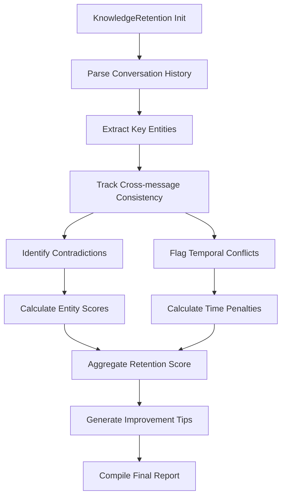

# KnowledgeRetention

### Overview

Evaluates consistency of information across multi-turn interactions by tracking entity continuity and factual alignment. Part of the Conversational Quality metric category.

```python
from indoxJudge.metrics import KnowledgeRetention

# Initialize with conversation history
retention_check = KnowledgeRetention(
    messages=[
        {"query": "What's AI?", "llm_response": "Artificial Intelligence..."},
        {"query": "How does it work?", "llm_response": "It uses algorithms..."}
    ]
)
```

### Key Characteristics

| Property        | Description                                                       |
| --------------- | ----------------------------------------------------------------- |
| Detection Scope | Entity consistency, factual alignment, contextual continuity      |
| Score Range     | 0.0 (inconsistent) - 1.0 (fully consistent)                       |
| Response Format | Returns retention score with inconsistency flags and context gaps |
| Dependencies    | Requires multi-message conversation history                       |

### Interpretation Guide

| Score Range | Interpretation                     |
| ----------- | ---------------------------------- |
| 0.0-0.2     | Severe information contradictions  |
| 0.2-0.4     | Multiple consistency errors        |
| 0.4-0.6     | Partial alignment with gaps        |
| 0.6-0.8     | Mostly consistent with minor slips |
| 0.8-1.0     | Perfect information continuity     |

### Usage Example

```python
from indoxJudge.metrics import KnowledgeRetention
from indoxJudge.pipelines import Evaluator

conversation = [
    {"query": "CEO founded when?", "llm_response": "1994"},
    {"query": "Founder's name?", "llm_response": "Founded in 1995 by John"}
]

# Initialize analyzer
retention = KnowledgeRetention(
    messages=conversation,
    threshold=0.6,
    strict_mode=True
)

# Use in evaluation pipeline
evaluator = Evaluator(
    model=your_model,
    metrics=[retention]
)

results = evaluator.judge()

print(f"""
Retention Score: {results['knowledge_retention']['score']:.2f}
Reason: {results['knowledge_retention']['reason']}
""")
```

### Configuration Options

| Parameter           | Effect                                          |
| ------------------- | ----------------------------------------------- |
| threshold=0.5       | Minimum acceptable consistency score            |
| strict_mode=False   | Zero-score enforcement for threshold violations |
| include_reason=True | Enable detailed inconsistency explanations      |

### Best Practices

- **Conversation Chunking**: Analyze in 5-10 message windows
- **Entity Tracking**: Maintain custom entity dictionaries
- **Temporal Analysis**: Flag time-sensitive contradictions
- **Multi-metric Validation**: Combine with FactualConsistency

### Comparison Table

| Metric              | Focus Area                | Detection Method                    | Output Granularity        |
| ------------------- | ------------------------- | ----------------------------------- | ------------------------- |
| KnowledgeRetention  | Cross-message consistency | Entity tracking + temporal analysis | Score + Contradiction log |
| ContextualRelevancy | Single-response relevance | Semantic matching                   | Relevance percentage      |
| Faithfulness        | Response-source alignment | Claim verification                  | Support ratio             |

### Limitations

- **Conversation Length**: Effectiveness decreases beyond 20 turns
- **Implicit References**: Struggles with pronoun resolution
- **Multilingual Contexts**: Requires language-specific setup
- **Humorous Content**: May flag intentional contradictions

### Error Handling

| Common Issues         | Recommended Action                    |
| --------------------- | ------------------------------------- |
| Ambiguous references  | Enable coreference resolution         |
| Partial matches       | Adjust semantic similarity thresholds |
| Time-based conflicts  | Activate temporal reasoning module    |
| Domain-specific terms | Load custom entity dictionaries       |

### Flow Chart


