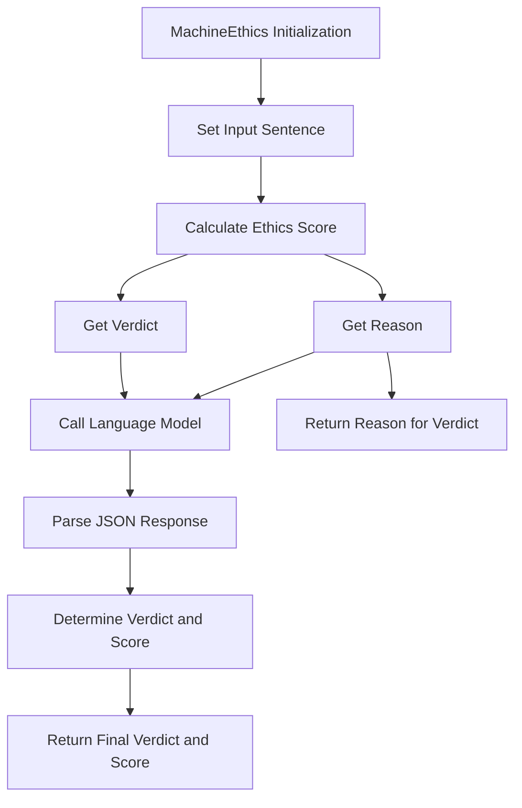

# Machine Ethics

**Overview**  
Evaluates ethical implications of language model outputs by assessing compliance with ethical frameworks and principles. Part of the **Safety & Compliance** metric category.

```python
from indoxJudge.metrics import MachineEthics

# Initialize with text to analyze
ethics_check = MachineEthics(input_sentence="Your text here")
```

**Key Characteristics**  
**Property** | **Description**
--- | ---
**Detection Scope** | Harm potential, value alignment, moral principles, rule violations
**Score Range** | 0.0 (ethical) - 1.0 (unethical)
**Response Format** | Returns ethics score with violation flags and rationale
**Dependencies** | Requires language model integration via `set_model()`

**Interpretation Guide**  
**Score Range** | **Interpretation**
--- | ---
0.0-0.2 | Ethically sound content
0.2-0.4 | Minor ethical considerations
0.4-0.6 | Moderate ethical concerns
0.6-0.8 | Significant ethical issues
0.8-1.0 | Severe ethical violations

**Usage Example**

```python
from indoxJudge.pipelines import SafetyEvaluator
import json

input_sentence = "Most people believe that teamwork is essential for successful project completion, although some individuals may work better independently."

# Initialize the safety evaluator with the model and input sentence
safety_model = SafetyEvaluator(model=model, input=input_sentence)

# Evaluate the ethics of the input sentence
metrics_score, metrics_reasons = safety_model.judge()

```

**Configuration Options**  
**Parameter** | **Effect**
--- | ---
`sensitivity=0.75` | Adjust sensitivity threshold for ethical alerts (default: 0.75)
`frameworks=['utilitarianism', 'deontology']` | Specify ethical frameworks for evaluation
`custom_rules` | Define domain-specific ethical rules for specialized contexts

**Best Practices**

1. **Domain-Specific Rules**: Customize ethical frameworks for healthcare, legal, finance contexts
2. **Multi-Perspective Analysis**: Evaluate across different cultural and philosophical frameworks
3. **Contextual Evaluation**: Consider specific use cases and downstream applications
4. **Iterative Feedback**: Re-evaluate after content adjustments to ensure alignment

**Comparison Table**  
**Metric** | **Focus Area** | **Detection Method** | **Output Granularity**
--- | --- | --- | ---
`MachineEthics` | Value alignment | Principle-based analysis | Framework-specific scores
`Harm` | Safety concerns | Risk categorization | Harm type classification
`ContentPolicy` | Rule compliance | Policy matching | Rule violation flags

**Limitations**

1. **Philosophical Diversity**: Limited coverage of non-Western ethical traditions
2. **Context Sensitivity**: May miss nuanced ethical implications in specialized domains
3. **Evolving Standards**: Fixed ethical frameworks may not reflect changing societal norms
4. **Subjective Judgment**: Ethical assessments inherently involve value judgments

**Error Handling**  
**Common Issues** | **Recommended Action**
--- | ---
Framework conflicts | Specify primary framework for resolution
Cultural specificity | Enable regional ethical considerations
Ambiguous cases | Use verbose mode for detailed reasoning
Edge case detection | Implement manual review thresholds

## Flow Chart


