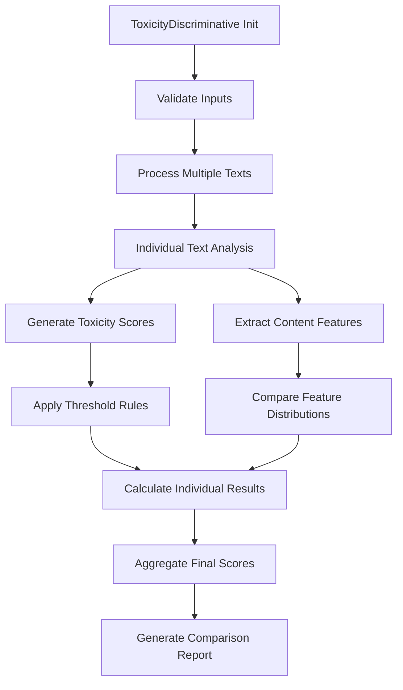

# Toxicity Discriminative

### Overview

Evaluates and discriminates toxic content in one or multiple text inputs by analyzing harmful, offensive, or inappropriate content using configurable thresholds and modes. Part of the Content Safety metric category.

```python
from indoxJudge.metrics import ToxicityDiscriminative

# Initialize with text inputs
toxicity_check = ToxicityDiscriminative(
    texts=["This is a normal review.", "This product is absolutely terrible!"],
    threshold=0.5
)
```

### Key Characteristics

| Property        | Description                                                             |
| --------------- | ----------------------------------------------------------------------- |
| Detection Scope | Discriminative analysis of harmful, offensive, or inappropriate content |
| Score Range     | 0.0 (non-toxic) - 1.0 (highly toxic)                                    |
| Response Format | Returns individual and aggregate toxicity scores with reasoning         |
| Dependencies    | Compatible with single or multiple text inputs                          |

### Interpretation Guide

| Score Range | Interpretation                |
| ----------- | ----------------------------- |
| 0.0-0.2     | No toxicity detected          |
| 0.2-0.4     | Minor insensitive language    |
| 0.4-0.6     | Moderate offensive content    |
| 0.6-0.8     | Substantial toxicity          |
| 0.8-1.0     | Severe toxic/harmful material |

### Usage Example

```python
from indoxJudge.metrics import ToxicityDiscriminative
from indoxJudge.pipelines import Evaluator

# Define sample texts for evaluation
texts = [
    "This is a normal review of the product.",
    "This product is absolutely terrible!",
    "The customer service was very helpful."
]

# Initialize analyzer
toxicity_discriminator = ToxicityDiscriminative(
    texts=texts,
    threshold=0.7,
    include_reason=True,
    strict_mode=False
)

# Use in evaluation pipeline
evaluator = Evaluator(
    model=language_model,
    metrics=[toxicity_discriminator]
)

results = evaluator.judge()

print(f"""
Overall Toxicity: {results['toxicity_discriminative']['score']:.2f}
Individual Scores: {results['toxicity_discriminative']['individual_scores']}
Reasons: {results['toxicity_discriminative']['reasons']}
""")
```

### Configuration Options

| Parameter           | Effect                                                            |
| ------------------- | ----------------------------------------------------------------- |
| threshold=0.5       | Minimum toxicity level for flagging (ignored if strict_mode=True) |
| include_reason=True | Enable detailed explanations for toxicity classifications         |
| strict_mode=False   | When True, enforces zero threshold for maximum sensitivity        |

### Best Practices

- **Comparative Analysis**: Use for direct comparison between multiple text variations
- **Content Moderation**: Apply different thresholds for different content categories
- **A/B Testing**: Compare toxicity levels between alternative content versions
- **Continuous Monitoring**: Track toxicity trends across content iterations

### Comparison Table

| Metric                 | Focus Area               | Detection Method           | Output Granularity            |
| ---------------------- | ------------------------ | -------------------------- | ----------------------------- |
| ToxicityDiscriminative | Multiple text comparison | Discriminative analysis    | Individual + Aggregate scores |
| Toxicity               | Single response analysis | Sentiment/content analysis | Score + Explanation           |
| Harmfulness            | Physical/legal safety    | Policy pattern matching    | Category flags                |

### Limitations

- **Context Boundaries**: May miss inter-text contextual relationships
- **Comparative Nuance**: May not capture subtle comparative differences
- **Language Dependencies**: Effectiveness varies across different languages
- **Domain Knowledge**: May require domain-specific calibration for specialized content

### Error Handling

| Common Issues             | Recommended Action                   |
| ------------------------- | ------------------------------------ |
| Invalid model responses   | Implement fallback scoring mechanism |
| JSON parsing errors       | Enable structured error recovery     |
| Invalid input formats     | Apply automatic text normalization   |
| Comparative discrepancies | Deploy confidence interval analysis  |

### Flow Chart


