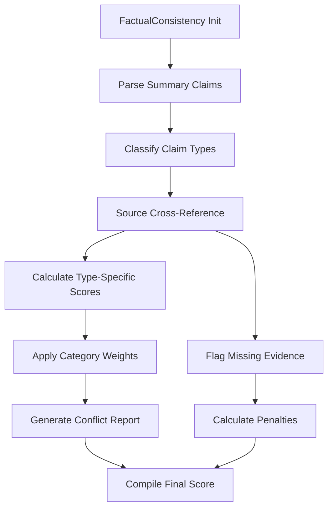

# Factual Consistency

## Overview

Evaluates alignment between generated summaries and source material through claim-level verification. Part of the Content Integrity metric category.

```python
from indoxJudge.metrics import FactualConsistency

# Initialize with summary and source
consistency_check = FactualConsistency(
    summary="Your generated text",
    source_text="Reference source material"
)
```

## Key Characteristics

| Property        | Description                                                    |
| --------------- | -------------------------------------------------------------- |
| Detection Scope | Numerical, entity, causal, descriptive, and comparative claims |
| Score Range     | 0.0 (inconsistent) - 1.0 (fully consistent)                    |
| Response Format | Returns score with conflicting claims and source references    |
| Dependencies    | Requires source text for verification                          |

## Interpretation Guide

| Score Range | Interpretation                      |
| ----------- | ----------------------------------- |
| 0.0-0.2     | Multiple factual contradictions     |
| 0.2-0.4     | Significant inconsistencies         |
| 0.4-0.6     | Partial accuracy with errors        |
| 0.6-0.8     | Mostly consistent with minor issues |
| 0.8-1.0     | Fully factually aligned             |

## Usage Example

```python
from indoxJudge.metrics import FactualConsistency
from indoxJudge.pipelines import Evaluator

summary = "Mars has 2 moons and a 25-hour day."
source = "The Martian day lasts 24h 37m. Phobos and Deimos orbit Mars."

# Initialize analyzer
fact_check = FactualConsistency(
    summary=summary,
    source_text=source,
    category_weights={"numerical": 0.4}
)

# Use in evaluation pipeline
evaluator = Evaluator(
    model=your_model,
    metrics=[fact_check]
)

results = evaluator.judge()

print(f"""
Consistency Score: {results['factual_consistency']['score']:.2f}
Conflicting Reason: {results['factual_consistency']['reason']}
""")
```

## Configuration Options

| Parameter                | Effect                                                                  |
| ------------------------ | ----------------------------------------------------------------------- |
| category_weights         | Custom claim type prioritization (default: numerical=0.25, entity=0.25) |
| consistency_threshold    | Minimum acceptable verification score (default: 0.8)                    |
| strict_verification=True | Require direct textual evidence                                         |

## Best Practices

- Source Quality: Verify source material reliability first
- Weight Tuning: Increase numerical weights for financial reports
- Multi-doc Analysis: Use with multi-source verification tools
- Version Control: Pair with document timestamp validation

## Comparison Table

| Metric             | Focus Area           | Detection Method      | Output Granularity       |
| ------------------ | -------------------- | --------------------- | ------------------------ |
| FactualConsistency | Claim verification   | Source cross-checking | Score + Conflict details |
| AnswerRelevancy    | Query-response match | Semantic similarity   | Relevance score          |
| TextualEntailment  | Logical consistency  | Inference detection   | Binary classification    |

## Limitations

- Implicit Knowledge: Requires explicit source statements
- Temporal Drift: Doesn't auto-detect outdated sources
- Quantitative Precision: Limited decimal/number parsing
- Cross-lingual Analysis: Source-summary language must match

## Error Handling

| Common Issues       | Recommended Action                 |
| ------------------- | ---------------------------------- |
| Ambiguous claims    | Enable claim clarification prompts |
| Missing sources     | Activate external database lookup  |
| Conflicting sources | Use majority voting mechanism      |
| Partial matches     | Adjust match similarity threshold  |

## Flow Chart


