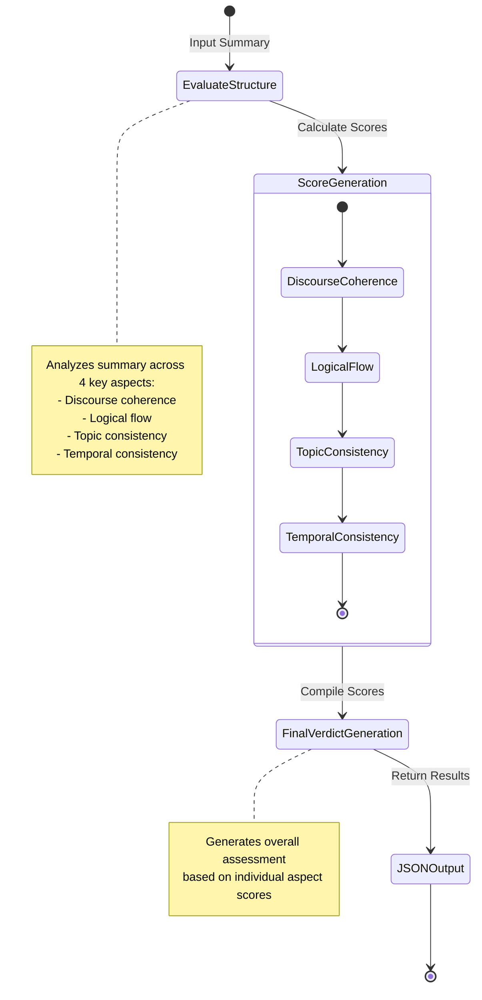

# Structure Quality

## Overview

Evaluates the structural quality of text through comprehensive analysis of coherence, logical flow, and consistency. Part of the Text Quality metric category.

```python
from indoxJudge.metrics import StructureQuality

# Initialize with summary to evaluate
structure_check = StructureQuality(
    summary="Your text here"
)
```

## Key Characteristics

| Property        | Description                                                   |
| --------------- | ------------------------------------------------------------- |
| Detection Scope | Discourse coherence, logical flow, topic/temporal consistency |
| Score Range     | 0.0 (poor structure) - 1.0 (excellent structure)              |
| Response Format | Returns score with detailed verdicts and reasoning            |
| Dependencies    | Flexible language model integration                           |

## Interpretation Guide

| Score Range | Interpretation                     |
| ----------- | ---------------------------------- |
| 0.0-0.2     | Severely disorganized              |
| 0.2-0.4     | Multiple structural issues         |
| 0.4-0.6     | Acceptable with some inconsistency |
| 0.6-0.8     | Mostly coherent                    |
| 0.8-1.0     | Optimal structural organization    |

## Usage Example

```python
from indoxJudge.metrics import StructureQuality
from indoxJudge.pipelines import Evaluator

summary = "Climate change is a global challenge. Rising temperatures affect ecosystems. Renewable energy offers solutions."

# Initialize analyzer
structure_metric = StructureQuality(
    summary=summary,
    weights={
        "discourse_coherence": 0.35,
        "logical_flow": 0.25,
        "topic_consistency": 0.25,
        "temporal_consistency": 0.15
    }
)

# Use in evaluation pipeline
evaluator = Evaluator(
    model=your_model,
    metrics=[structure_metric]
)

results = evaluator.judge()

# Access comprehensive report
print(f"""
Structure Score: {results['structure_quality']['score']:.2f}
Reasoning: {results['structure_quality']['reason']}
""")
```

## Configuration Options

| Parameter            | Effect                                                                                     |
| -------------------- | ------------------------------------------------------------------------------------------ | --- |
| weights              | Customize aspect importance (default: discourse=0.3, logical=0.3, topic=0.2, temporal=0.2) |     |
| verbose_output=True  | Enable detailed aspect-specific explanations                                               |
| logging_level="INFO" | Set token usage and processing logging detail                                              |

## Best Practices

- **Context Weighting**: Adjust weights based on content type (narrative vs. technical)
- **Model Selection**: Choose appropriate language models for domain-specific analysis
- **Multi-metric Analysis**: Combine with Coherence and Clarity evaluations
- **Iterative Refinement**: Use verdict feedback to improve document structure

## Comparison Table

| Metric           | Focus Area                   | Detection Method                  | Output Granularity         |
| ---------------- | ---------------------------- | --------------------------------- | -------------------------- |
| StructureQuality | Overall structural integrity | Multi-aspect analysis with LLM    | Score + Aspect verdicts    |
| Coherence        | Text flow                    | Transition and reference analysis | Coherence breakdown        |
| Organization     | Section arrangement          | Structural pattern detection      | Organizational suggestions |

## Limitations

- **Content Specificity**: Structure norms vary by document type
- **Language Variation**: Different discourse patterns across languages
- **Model Dependence**: Quality dependent on language model capabilities
- **Genre Sensitivity**: Different expectations for creative vs. technical text

## Error Handling

| Common Issues               | Recommended Action                   |
| --------------------------- | ------------------------------------ |
| Model response parsing      | Activate fallback evaluation methods |
| Invalid weight distribution | Auto-normalize weight configurations |
| Empty or minimal text       | Apply minimum content thresholds     |
| Complex nested structures   | Enable hierarchical analysis mode    |

## Flow Chart


