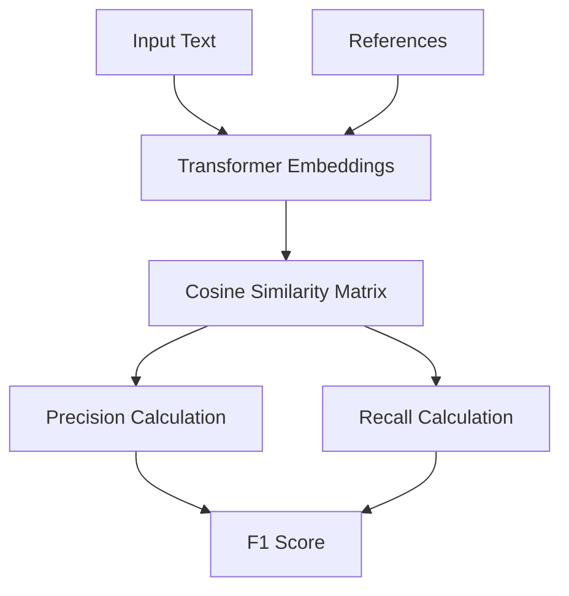
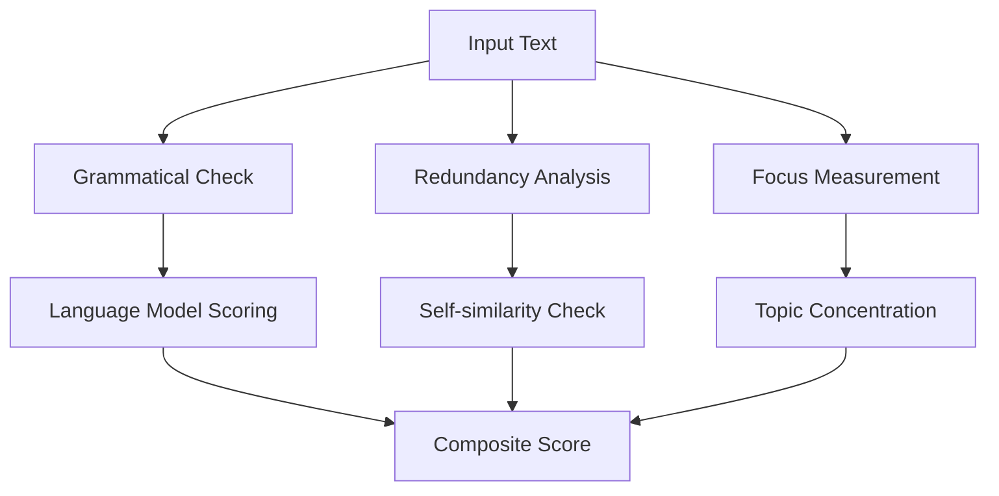

# Advanced NLP Evaluation Metrics

## BERTScore

### Overview

Evaluates semantic similarity using transformer embeddings. Part of Semantic Evaluation category.

```python
from indoxJudge.metrics import BertScore

bert = BertScore(
    llm_response=generated_text,
    retrieval_context=reference_texts,
    model_name="roberta-large"
)
```

### Key Characteristics

| Property         | Description                               |
| ---------------- | ----------------------------------------- |
| Embedding Model  | Configurable transformer architecture     |
| Score Components | Precision, Recall, F1 (cosine similarity) |
| Context Handling | Supports multiple reference texts         |
| GPU Acceleration | Automatic CUDA detection                  |

### Interpretation Guide

| F1 Score Range | Semantic Match             |
| -------------- | -------------------------- |
| 0.0-0.4        | Weak semantic relationship |
| 0.4-0.6        | Partial meaning overlap    |
| 0.6-0.8        | Strong semantic alignment  |
| 0.8-1.0        | Near-identical meaning     |

### Usage Example

```python
bert_metric = BertScore(
    llm_response=generated_summary,
    retrieval_context=reference_articles,
    model_name="bert-large-nli",
    max_length=512
)

evaluator = Evaluator(model=None, metrics=[bert_metric])
print(f"BERTScore F1: {evaluator.judge()['bert_score']['f1']:.2f}")
```

### Evaluation Process



## G-Eval

### Overview

Multi-dimensional evaluation framework for comprehensive text assessment.

```python
from indoxJudge.metrics import GEval

geval = GEval(
    parameters="summary",
    query=user_query,
    llm_response=generated_text,
    ground_truth=reference_text
)
```

# Configuration Matrix

| Parameter         | Evaluation Method           | Description                                                             |
| ----------------- | --------------------------- | ----------------------------------------------------------------------- |
| Retrieval Quality | Document relevance analysis | Evaluates if retrieved documents/snippets are relevant and accurate     |
| Integration       | Information synthesis       | Assesses how well retrieved information is integrated into the response |
| Coherence         | Logical structure analysis  | Checks if text is logically structured and easy to follow               |
| Relevance         | Topic coverage assessment   | Evaluates relevance to main topic and coverage of key points            |
| Accuracy          | Factual verification        | Checks factual accuracy and consistency with source material            |
| Fluency           | Grammatical assessment      | Evaluates readability and grammatical correctness                       |
| Comprehensiveness | Completeness check          | Assesses coverage of all key points and thoroughness                    |
| Contextuality     | Context alignment           | Evaluates how well response fits within query context                   |

### Interpretation Guide

| Composite Score | Quality Level   |
| --------------- | --------------- |
| 0.0-2.5         | Poor/inadequate |
| 2.5-5.0         | Basic/partial   |
| 5.0-7.5         | Competent       |
| 7.5-10.0        | Expert-level    |

### Usage Example

```python
geval_metric = GEval(
    query="Explain quantum computing",
    llm_response=generated_explanation,
    ground_truth=reference_material
)

evaluator = Evaluator(model=llm, metrics=[geval_metric])
results = evaluator.judge()
```

## GRUEN

### Overview

Evaluates text quality through grammatical, redundancy, and focus analysis.

```python
from indoxJudge.metrics import Gruen

gruen = Gruen(
    candidates=[text1, text2],
)
```

### Quality Indicators

- Grammaticality: Language correctness
- Redundancy: Information repetition
- Focus: Topical concentration

### Interpretation Guide

| Score Type     | Range | Optimal Value |
| -------------- | ----- | ------------- |
| Grammaticality | 0-1   | &gt;0.85      |
| Redundancy     | 0-1   | &lt;0.15      |
| Focus          | 0-1   | &gt;0.75      |

### Usage Example

```python
gruen_metric = Gruen(
    candidates=[
        "The quick brown fox jumps...",
        "A fast vulpine leaps..."
    ]
)

evaluator = Evaluator(model=llm, metrics=[gruen_metric])
print(f"GRUEN Score: {evaluator.judge()['gruen']}")
```

### Evaluation Process



## Comparison of Advanced Metrics

| Metric    | Strength               | Evaluation Depth | Speed  |
| --------- | ---------------------- | ---------------- | ------ |
| BERTScore | Semantic understanding | High             | Medium |
| G-Eval    | Comprehensive analysis | Very High        | Slow   |
| GRUEN     | Text quality focus     | Medium           | Fast   |

### Use Case Guide

- Research Papers: BERTScore + G-Eval
- Content Moderation: GRUEN + BERTScore
- Technical Writing: G-Eval (full parameters)
