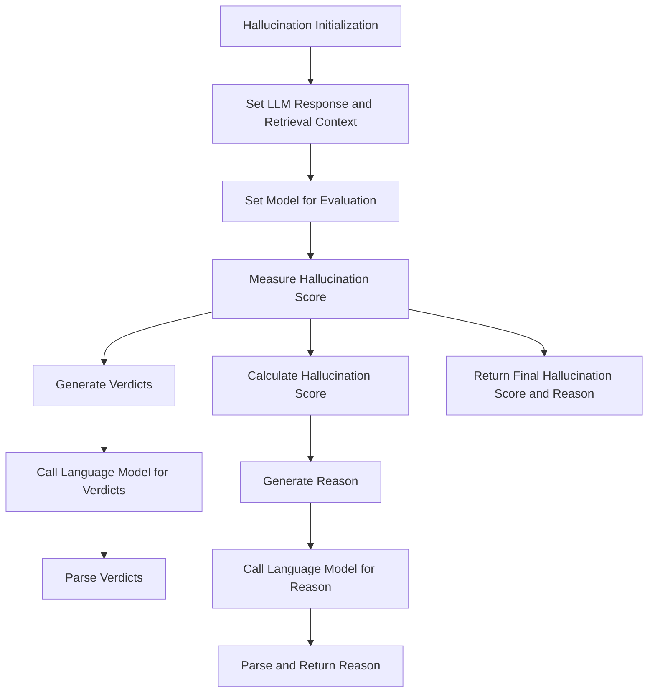

# Hallucination

**Overview**  
Evaluates hallucinations in language model outputs by comparing generated responses against retrieval context. Part of the **Accuracy & Reliability** metric category.

```python
from indoxJudge.metrics import Hallucination

# Initialize with response and context
hallucination_check = Hallucination(
    llm_response="The response to evaluate",
    retrieval_context="The ground truth context"
)
```

**Key Characteristics**  
**Property** | **Description**
--- | ---
**Detection Scope** | Factual inconsistencies, fabricated information, context deviation
**Score Range** | 0.0 (no hallucination) - 1.0 (complete hallucination)
**Response Format** | Returns hallucination score with detailed reasoning
**Dependencies** | Requires language model integration via `set_model()`

**Interpretation Guide**  
**Score Range** | **Interpretation**
--- | ---
0.0-0.2 | Highly accurate, minimal deviation from context
0.2-0.4 | Minor inconsistencies present
0.4-0.6 | Moderate fabrication or context misrepresentation
0.6-0.8 | Significant factual errors or invented information
0.8-1.0 | Severe hallucination with little connection to retrieval context

**Usage Example**

```python
import os
from dotenv import load_dotenv
from indoxJudge.models import OpenAi
from indoxJudge.metrics import Hallucination
from indoxJudge.pipelines import Evaluator

load_dotenv()
OPENAI_API_KEY = os.getenv("OPENAI_API_KEY")

# Initialize the language model
llm = OpenAi(api_key=OPENAI_API_KEY, model="Open AI Model")

# Define the response and retrieval context
llm_response = "The Eiffel Tower is located in Berlin."
retrieval_context = "The Eiffel Tower is located in Paris, France."

# Initialize hallucination detector
hallucination = Hallucination(
    llm_response=llm_response,
    retrieval_context=retrieval_context,
    threshold=0.5,
    include_reason=True,
    strict_mode=False
)

# Use in evaluation pipeline
evaluator = Evaluator(model=llm, metrics=[hallucination])
results = evaluator.judge()

# Access comprehensive report
print(f"""
Hallucination Score: {results['hallucination']['score']:.2f}
Reason: {results['hallucination']['reason']}
""")
```

**Configuration Options**  
**Parameter** | **Effect**
--- | ---
`threshold=0.5` | Defines hallucination detection threshold (default: 0.5)
`include_reason=True` | Enables detailed reasoning for verdict (default: True)
`strict_mode=False` | Forces score of 1.0 if threshold exceeded (default: False)

**Best Practices**

1. **Context Quality**: Provide comprehensive, high-quality retrieval context
2. **Threshold Tuning**: Adjust threshold based on use case criticality
3. **Complementary Metrics**: Combine with `Relevance` and `Coherence` for complete evaluation
4. **Domain Specificity**: Consider domain-specific hallucination patterns

**Comparison Table**  
**Metric** | **Focus Area** | **Detection Method** | **Output Granularity**
--- | --- | --- | ---
`Hallucination` | Factual accuracy | Context comparison | Score + Detailed reasoning
`Relevance` | On-topic response | Topic modeling | Topic adherence analysis
`Coherence` | Logical consistency | Structural analysis | Internal consistency assessment

**Limitations**

1. **Context Dependency**: Performance tied to retrieval context quality
2. **Nuance Challenges**: Difficulty with implicit information and inferences
3. **Domain Knowledge**: May struggle with highly specialized content
4. **Boundary Cases**: Ambiguity with partial truths or subjective statements

**Error Handling**  
**Common Issues** | **Recommended Action**
--- | ---
Insufficient context | Expand retrieval context with relevant information
Ambiguous statements | Enable `include_reason` for detailed analysis
Domain-specific jargon | Use domain-adapted models when available
Threshold sensitivity | Experiment with threshold values for optimal detection

## Flow Chart


