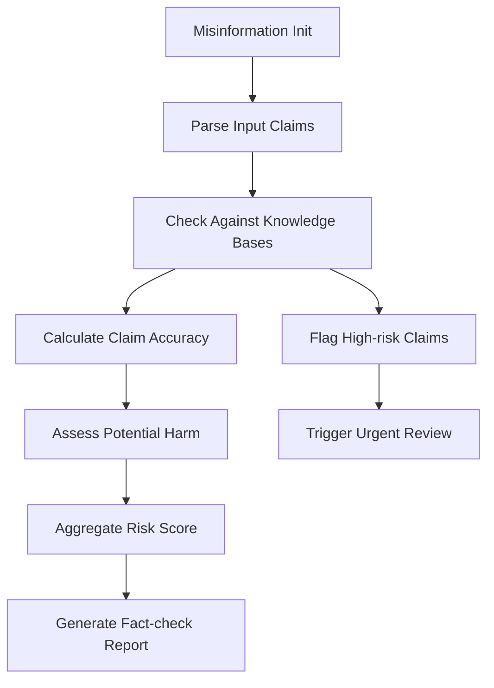

# Misinformation

### Overview

Identifies potentially false or misleading claims in text outputs through fact-checking and credibility analysis. Part of the Content Integrity metric category.

```python
from indoxJudge.metrics import Misinformation

# Initialize with text to analyze
truth_check = Misinformation(input_sentence="Your text here")
```

### Key Characteristics

| Property        | Description                                                      |
| --------------- | ---------------------------------------------------------------- |
| Detection Scope | Factual inaccuracies, unsupported claims, outdated information   |
| Score Range     | 0.0 (accurate) - 1.0 (misleading)                                |
| Response Format | Returns risk score with flagged claims and fact-check references |
| Dependencies    | Requires fact-checking API integration                           |

### Interpretation Guide

| Score Range | Interpretation                         |
| ----------- | -------------------------------------- |
| 0.0-0.2     | Verified accurate information          |
| 0.2-0.4     | Mostly factual with minor inaccuracies |
| 0.4-0.6     | Mixed accuracy with some false claims  |
| 0.6-0.8     | Significant misleading content         |
| 0.8-1.0     | Dangerous misinformation               |

### Usage Example

```python
from indoxJudge.metrics import Misinformation
from indoxJudge.pipelines import Evaluator

text = "Vaccines contain microchips for population tracking"

# Initialize analyzer
misinfo_check = Misinformation(input_sentence=text)

# Use in evaluation pipeline
evaluator = Evaluator(
    model=your_model,
    metrics=[misinfo_check]
)

results = evaluator.judge()

print(f"""
Misinformation Risk: {results['misinformation']['score']:.2f}
Flagged Claims: {results['misinformation']['flagged_claims']}
Fact Checks: {results['misinformation']['references']}
""")
```

### Configuration Options

| Parameter                | Effect                                      |
| ------------------------ | ------------------------------------------- |
| confidence_threshold=0.8 | Minimum confidence for flagging claims      |
| realtime_checks=True     | Enable live fact-checking API queries       |
| severity_weight=0.7      | Adjust impact weighting for harmful content |

### Best Practices

- **Source Verification**: Maintain updated fact-checking databases
- **Context Analysis**: Cross-reference with domain-specific knowledge bases
- **Temporal Filtering**: Flag outdated information automatically
- **Severity Grading**: Prioritize health/safety-related misinformation

### Comparison Table

| Metric             | Focus Area        | Detection Method        | Output Granularity       |
| ------------------ | ----------------- | ----------------------- | ------------------------ |
| Misinformation     | Factual accuracy  | Claim verification      | Score + Fact-check links |
| FactualConsistency | Source alignment  | Text comparison         | Consistency percentage   |
| Faithfulness       | Context grounding | Source-supported claims | Support ratio            |

### Limitations

- **Emerging Claims**: Lag in detecting new misinformation
- **Satire Detection**: Challenges with parody/humor
- **Cultural Context**: Variations in truth perceptions
- **Ambiguous Statements**: Uncertainty in probabilistic claims

### Error Handling

| Common Issues         | Recommended Action                 |
| --------------------- | ---------------------------------- |
| Unverifiable claims   | Activate source triangulation      |
| Contradictory sources | Implement majority consensus check |
| Technical jargon      | Use domain-specific validators     |
| Breaking news         | Enable provisional scoring         |

### Flow Chart


