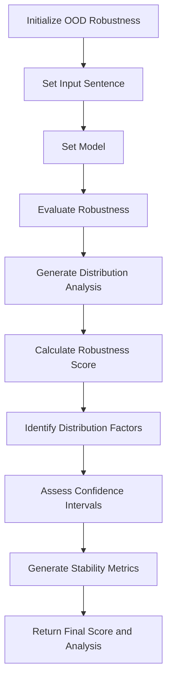

# Out-Of-Distribution Robustness

**Overview**  
Evaluates how well language models handle inputs that significantly differ from training distribution patterns. Part of the **Reliability & Resilience** metric category.

```python
from indoxJudge.metrics import OutOfDistributionRobustness

# Initialize with text to analyze
ood_check = OutOfDistributionRobustness(input_sentence="Your text here")
```

**Key Characteristics**  
**Property** | **Description**
--- | ---
**Detection Scope** | Novel inputs, domain shifts, rare vocabulary, unusual structures
**Score Range** | 0.0 (low robustness) - 1.0 (high robustness)
**Response Format** | Returns robustness score with confidence intervals and stability metrics
**Dependencies** | Requires language model integration via `set_model()`

**Interpretation Guide**  
**Score Range** | **Interpretation**
--- | ---
0.0-0.2 | Severe distribution brittleness
0.2-0.4 | Significant performance degradation
0.4-0.6 | Moderate distribution handling
0.6-0.8 | Good generalization ability
0.8-1.0 | Excellent distribution robustness

**Usage Example**

```python
from indoxJudge.metrics import OutOfDistributionRobustness
from indoxJudge.pipelines import Evaluator

# Define a sample input sentence
input_sentence = "The quantum fluctuations in the hyperdimensional matrix caused unexpected resonance."

# Initialize the OutOfDistributionRobustness object
ood_robustness = OutOfDistributionRobustness(
    input_sentence=input_sentence
)

# Set up the evaluator
evaluator = Evaluator(model=language_model, metrics=[ood_robustness])

# Get the evaluation results
results = evaluator.judge()

# Access the robustness metrics
print(f"""
OOD Robustness Score: {results['ood_robustness']['score']:.2f}
Confidence Interval: {results['ood_robustness']['confidence_interval']}
Detected Factors: {results['ood_robustness']['distribution_factors']}
""")
```

**Configuration Options**  
**Parameter** | **Effect**
--- | ---
`template=CustomTemplate()` | Override default OODRobustnessTemplate
`distribution_threshold=0.7` | Set detection threshold for OOD content
`stability_mode=True` | Enable additional stability metrics

**Best Practices**

1. **Domain-Specific Testing**: Evaluate with inputs from specialized domains outside model training
2. **Edge Case Coverage**: Test with rare vocabulary, syntactic structures, and conceptual combinations
3. **Progressive Complexity**: Start with mild OOD examples and increase difficulty
4. **Cross-Domain Validation**: Verify performance across multiple distribution shifts

**Comparison Table**  
**Metric** | **Focus Area** | **Detection Method** | **Output Granularity**
--- | --- | --- | ---
`OutOfDistributionRobustness` | Distribution shift | Distributional analysis | Distribution shift factors
`Uncertainty` | Confidence estimation | Probability calibration | Confidence intervals
`Consistency` | Stable responses | Input perturbation | Stability scores

**Limitations**

1. **Unknown Unknowns**: Cannot detect all possible distribution shifts
2. **Benchmark Dependency**: Effectiveness depends on OOD example quality
3. **Computational Intensity**: Thorough evaluation requires multiple distribution samples
4. **Domain Knowledge Gaps**: May struggle with specialized domain expertise requirements

**Error Handling**  
**Common Issues** | **Recommended Action**
--- | ---
Invalid model responses | Implement retry logic with backoff
JSON parsing errors | Enable robust parsing with fallback mechanisms
Template rendering issues | Check template compatibility with model version
Invalid input formats | Preprocess inputs for consistent formatting

## Flow Chart


