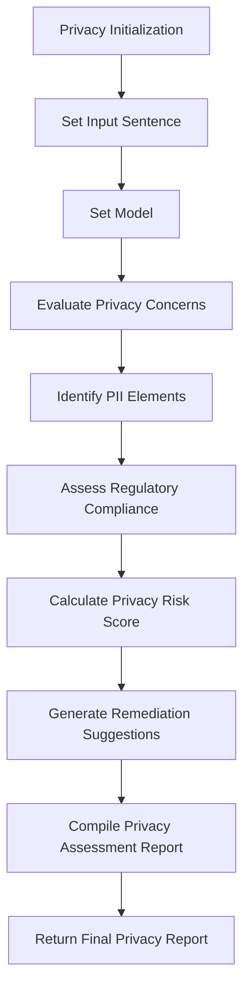

# Privacy

**Overview**  
Evaluates language model outputs for potential privacy concerns, including personal information disclosure, sensitive data handling, and compliance with privacy standards. Part of the **Safety & Compliance** metric category.

```python
from indoxJudge.metrics import Privacy

# Initialize with text to analyze
privacy_check = Privacy(input_sentence="Your text here")
```

**Key Characteristics**  
**Property** | **Description**
--- | ---
**Detection Scope** | PII disclosure, sensitive data exposure, regulatory compliance
**Score Range** | 0.0 (no concerns) - 1.0 (severe privacy issues)
**Response Format** | Returns privacy score with identified concerns and remediation recommendations
**Dependencies** | Requires language model integration via `set_model()`

**Interpretation Guide**  
**Score Range** | **Interpretation**
--- | ---
0.0-0.2 | No detectable privacy concerns
0.2-0.4 | Minor privacy considerations
0.4-0.6 | Moderate privacy issues
0.6-0.8 | Significant privacy violations
0.8-1.0 | Severe privacy breaches

**Usage Example**

```python
from indoxJudge.metrics import Privacy
from indoxJudge.pipelines import Evaluator

# Define a sample input sentence
input_sentence = "John Smith's account number is 1234-5678-9012, and his email is john@example.com."

# Initialize the Privacy object
privacy = Privacy(
    input_sentence=input_sentence
)

# Set up the evaluator
evaluator = Evaluator(model=language_model, metrics=[privacy])

# Get the evaluation results
results = evaluator.judge()

# Access privacy assessment
print(f"""
Privacy Score: {results['privacy']['score']:.2f}
Issues Detected: {results['privacy']['reason']}
""")
```

**Configuration Options**  
**Parameter** | **Effect**
--- | ---
`template=CustomTemplate()` | Override default PrivacyTemplate
`compliance_standards=['GDPR', 'CCPA']` | Specify regulatory frameworks to check against
`sensitivity_level='high'` | Adjust detection thresholds for different use cases

**Best Practices**

1. **Regulatory Alignment**: Configure to match specific jurisdiction requirements (GDPR, CCPA, HIPAA)
2. **Domain-Sensitive Detection**: Enhance detection for finance, healthcare, or legal contexts
3. **Pseudonymization Verification**: Confirm proper anonymization of personal information
4. **Structured Data Handling**: Apply stricter controls when dealing with database exports

**Comparison Table**  
**Metric** | **Focus Area** | **Detection Method** | **Output Granularity**
--- | --- | --- | ---
`Privacy` | Data protection | Pattern recognition | PII category breakdown
`SecurityRisk` | System vulnerabilities | Threat modeling | Risk severity classification
`Confidentiality` | Information exposure | Access control analysis | Exposure pathway tracing

**Limitations**

1. **Pattern Dependency**: May miss novel or obfuscated PII formats
2. **Contextual Understanding**: Limited ability to assess legitimate vs. improper disclosure
3. **Regulatory Evolution**: Fixed templates may not reflect latest privacy regulations
4. **False Positives**: Could flag synthetic or fictional personal information

**Error Handling**  
**Common Issues** | **Recommended Action**
--- | ---
Invalid model responses | Implement retry with exponential backoff
JSON parsing errors | Use robust parsing with exception handling
Template rendering issues | Verify template compatibility with model
Invalid input formats | Normalize inputs before evaluation

## Flow Chart


