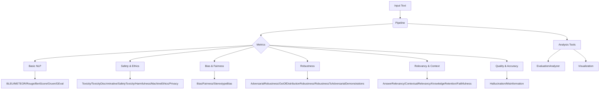

# System Architecture

## Core Components

## Component Breakdown

### 1. Evaluation Pipelines

| Component            | Responsibility                    | Key Methods             |
| -------------------- | --------------------------------- | ----------------------- |
| `Evaluator`          | Base evaluation workflow          | `judge()`, `validate()` |
| `LLMEvaluator`       | General language model assessment | `set_metrics()`         |
| `RagEvaluator`       | RAG system validation             | `check_retrieval()`     |
| `SafetyEvaluator`    | Content safety scanning           | `detect_harm()`         |
| `SummaryEvaluator`   | Summarization-specific checks     | `assess_coverage()`     |
| `EvaluationAnalyzer` | Compare multiple LLMs             | `compare_models()`      |

### 2. Metric Categories

| Category            | Example Metrics                                                                           | Scoring Range     |
| ------------------- | ----------------------------------------------------------------------------------------- | ----------------- |
| Basic NLP           | BLEU, ROUGE, METEOR, BertScore, Gruen, GEval                                              | 0.0-1.0           |
| Relevancy & Context | AnswerRelevancy, ContextualRelevancy, KnowledgeRetention, Faithfulness                    | Binary + Score    |
| Safety & Ethics     | Toxicity, ToxicityDiscriminative, SafetyToxicity, Harmfulness, MachineEthics, Privacy     | 0.0-1.0           |
| Bias & Fairness     | Bias, Fairness, StereotypeBias                                                            | 0.0-1.0           |
| Quality & Accuracy  | Hallucination, Misinformation                                                             | Multi-Dimensional |
| Robustness          | AdversarialRobustness, OutOfDistributionRobustness, RobustnessToAdversarialDemonstrations | 0.0-1.0           |
| Summary-Specific    | SummaryBertScore, SummaryBleu, Conciseness, FactualConsistency, InformationCoverage       | Multi-Dimensional |

## Workflow Stages

1. **Input Processing**

   - Text normalization
   - Context embedding
   - Dependency parsing

2. **Aggregated Analysis**

   - Cross-metric correlation
   - Confidence weighting
   - Threshold-based alerts

3. **Reporting**

- Interactive visualizations
- Exportable JSON/CSV
- Audit trails
