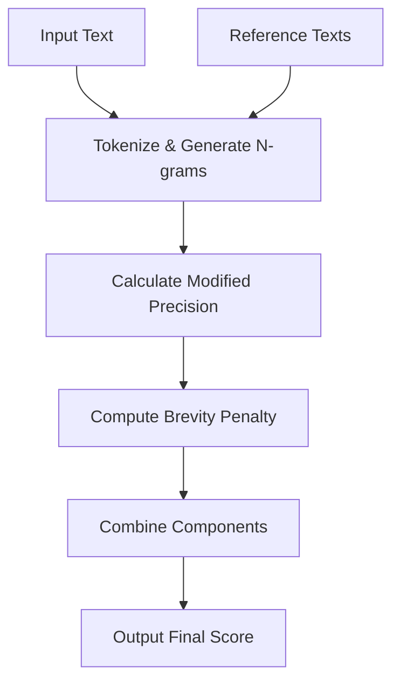
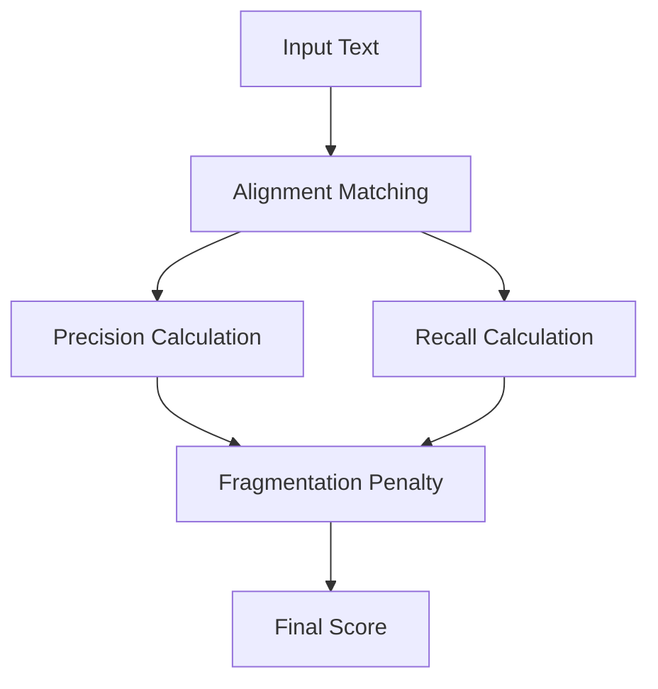
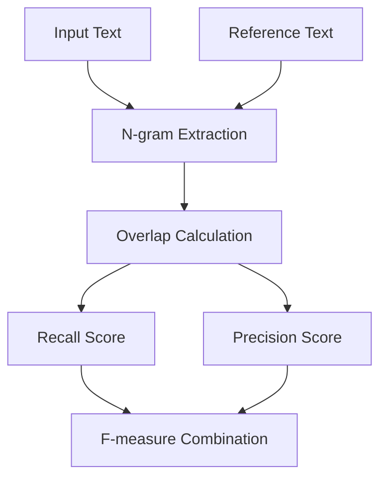

# Basic NLP Evaluation Metrics

## BLEU (Bilingual Evaluation Understudy)

### Overview

Evaluates text similarity using modified n-gram precision with brevity penalty. Part of the Basic NLP Metrics category.

```python
from indoxJudge.metrics import BLEU

# Initialize with response and references
bleu = BLEU(
    llm_response=generated_text,
    retrieval_context=reference_texts
)
```

## Key Characteristics

| Property           | Description                              |
| ------------------ | ---------------------------------------- |
| N-gram Focus       | 1-4 gram precision (default: bigrams)    |
| Brevity Penalty    | Penalizes shorter-than-reference outputs |
| Repeating Patterns | Optional repeating n-gram filtering      |
| Score Range        | 0.0 (no match) - 1.0 (exact match)       |

## Interpretation Guide

| Score Range | Translation Quality          |
| ----------- | ---------------------------- |
| 0.0-0.3     | Poor/nonsensical match       |
| 0.3-0.6     | Partial meaning preservation |
| 0.6-0.8     | Good semantic alignment      |
| 0.8-1.0     | Near-perfect equivalence     |

## Usage Example

```python
bleu_metric = BLEU(
    llm_response="The fast fox jumps high",
    retrieval_context=[
        "A quick brown fox leaps",
        "The speedy fox jumps"
    ],
    n=4,  # Use 4-grams
    remove_repeating_ngrams=True
)

evaluator = Evaluator(model=None, metrics=[bleu_metric])
print(f"BLEU-4 Score: {evaluator.judge()['bleu']:.2f}")
```

## Configuration Options

| Parameter               | Effect                                              |
| ----------------------- | --------------------------------------------------- |
| n=2                     | Maximum n-gram size (1-4)                           |
| remove_repeating_ngrams | Filters redundant n-gram patterns                   |
| Multiple References     | Improves score stability through variance averaging |

## Evaluation Process



## Best Practices

1. Use 4-grams for translation tasks
2. Enable repeating n-gram filter for creative writing
3. Provide ≥4 references for reliable scoring
4. Combine with METEOR for semantic analysis

## Limitations

1. Insensitive to word order changes
2. Fails to capture semantic meaning
3. Over-penalizes length variations
4. Requires lexical overlap

## Comparison with Similar Metrics

| Metric | Precision Focus  | Length Handling       | Semantic Awareness |
| ------ | ---------------- | --------------------- | ------------------ |
| BLEU   | N-gram matches   | Brevity penalty       | Low                |
| METEOR | Stem matches     | Fragmentation control | Medium             |
| ROUGE  | Longest sequence | No penalty            | None               |

## METEOR

### Overview

Measures text similarity using combined precision, recall, and fragmentation analysis.

```python
from indoxJudge.metrics import METEOR

meteor = METEOR(
    llm_response="The quick fox jumps",
    retrieval_context=["A fast fox leaps"]
)
```

### Key Parameters

| Parameter         | Description                      |
| ----------------- | -------------------------------- |
| llm_response      | Generated text to evaluate       |
| retrieval_context | Reference text(s) for comparison |

### Interpretation Guide

| Score Range | Quality           |
| ----------- | ----------------- |
| 0.0-0.3     | Poor match        |
| 0.3-0.6     | Partial alignment |
| 0.6-0.8     | Strong similarity |
| 0.8-1.0     | Near-exact match  |

### Usage Example

```python
meteor_metric = METEOR(
    llm_response=generated_text,
    retrieval_context=reference_texts
)

evaluator = Evaluator(model=None, metrics=[meteor_metric])
print(evaluator.judge()['meteor'])
```

### Evaluation Process



## ROUGE

### Overview

Evaluates text similarity through n-gram overlap analysis.

```python
from indoxJudge.metrics import Rouge

rouge = Rouge(
    llm_response=generated_summary,
    retrieval_context=reference_texts,
    n=2  # Bigrams
)
```

### Key Parameters

| Parameter         | Description               |
| ----------------- | ------------------------- |
| llm_response      | Text to evaluate          |
| retrieval_context | Ground truth reference(s) |
| n                 | N-gram size (default=1)   |

### Interpretation Guide

| Score Type | Range | Focus            |
| ---------- | ----- | ---------------- |
| ROUGE-N    | 0-1   | Word overlap     |
| ROUGE-L    | 0-1   | Longest sequence |

### Usage Example

```python
rouge_metric = Rouge(
    llm_response="The cat sat on mat",
    retrieval_context=["A cat sits on the mat"],
    n=1
)

evaluator = Evaluator(model=None, metrics=[rouge_metric])
print(evaluator.judge()['rouge'])
```

### Evaluation Process



<!-- ## Comparison of Basic Metrics

| Metric | Strength                             | Ideal Use Case           |
| ------ | ------------------------------------ | ------------------------ |
| Bias   | Detects subjective language patterns | Content moderation       |
| METEOR | Handles paraphrasing well            | Machine translation      |
| ROUGE  | Computationally efficient            | Summarization evaluation | -->
