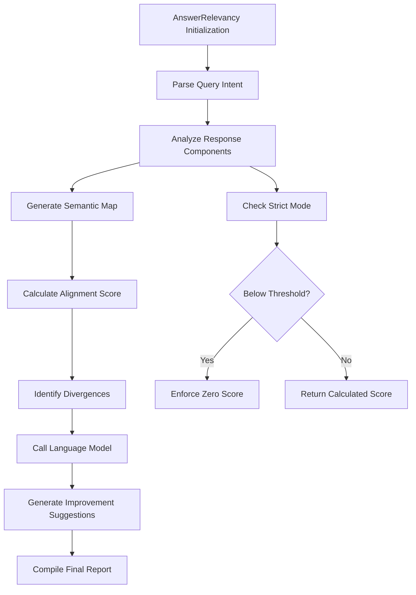

# AnswerRelevancy

## Overview

Evaluates how well language model responses align with query intent and context. Part of the Response Quality metric category.

```python
from indoxJudge.metrics import AnswerRelevancy

# Initialize with query and response
relevancy_check = AnswerRelevancy(
    query="Your question here",
    llm_response="Model's response here"
)
```

## Key Characteristics

| Property        | Description                                                                    |
| --------------- | ------------------------------------------------------------------------------ |
| Detection Scope | Response alignment with query intent, off-topic content, contextual drift      |
| Score Range     | 0.0 (irrelevant) - 1.0 (highly relevant)                                       |
| Response Format | Returns relevancy score with irrelevant statements and improvement suggestions |
| Dependencies    | Requires language model integration via set_model()                            |

## Interpretation Guide

| Score Range | Interpretation                                 |
| ----------- | ---------------------------------------------- |
| 0.0-0.2     | Completely irrelevant response                 |
| 0.2-0.4     | Partial relevance with major off-topic content |
| 0.4-0.6     | Addresses basic intent but misses nuances      |
| 0.6-0.8     | Relevant with minor inconsistencies            |
| 0.8-1.0     | Fully aligned with query intent                |

## Usage Example

```python
from indoxJudge.metrics import AnswerRelevancy
from indoxJudge.pipelines import Evaluator

query = "Explain quantum computing basics"
response = "Quantum physics studies subatomic particles..."

# Initialize analyzer
relevancy = AnswerRelevancy(
    query=query,
    llm_response=response,
    threshold=0.6,
    strict_mode=True
)

# Use in evaluation pipeline
evaluator = Evaluator(
    model=your_model,
    metrics=[relevancy]
)

results = evaluator.judge()

# Access comprehensive report
print(f"""
Relevancy Score: {results['answer_relevancy']['score']:.2f}
Irrelevant Statements: {results['answer_relevancy']['irrelevant_points']}
Improvement Suggestions: {results['answer_relevancy']['suggestions']}
""")
```

## Configuration Options

| Parameter           | Effect                                            |
| ------------------- | ------------------------------------------------- |
| threshold=0.5       | Minimum acceptable relevancy score (default: 0.5) |
| strict_mode=False   | Zero-score enforcement below threshold            |
| include_reason=True | Enable detailed rationale generation              |

## Best Practices

- **Context Enrichment**: Provide domain-specific terminology lists
- **Threshold Strategy**: Use strict mode for factual QA applications
- **Multi-axis Analysis**: Combine with ContextualDepth and FactualAccuracy
- **Iterative Tuning**: Adjust thresholds based on query complexity tiers

## Comparison Table

| Metric              | Focus Area                 | Detection Method             | Output Granularity          |
| ------------------- | -------------------------- | ---------------------------- | --------------------------- |
| AnswerRelevancy     | Query-response alignment   | Semantic similarity analysis | Score + Irrelevant segments |
| ContextualRelevancy | Document-context alignment | Context matching             | Percentage match            |
| TopicConsistency    | Theme preservation         | Topic modeling               | Deviation index             |

## Limitations

- **Ambiguity Challenge**: Struggles with deliberately open-ended queries
- **Cultural Context**: May flag legitimate regional variations as irrelevant
- **Sarcasm Detection**: Limited capability with ironic or humorous responses
- **Multilingual Nuance**: Decreasing accuracy with code-switched content

## Error Handling

| Common Issues         | Recommended Action                   |
| --------------------- | ------------------------------------ |
| Ambiguous queries     | Request query clarification context  |
| Multiple subquestions | Enable atomic question parsing       |
| Technical jargon      | Provide domain glossary              |
| Metaphorical language | Activate figurative speech detection |

## Flow Chart


