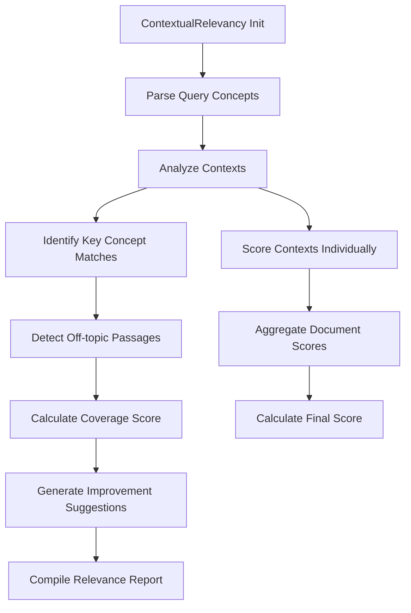

# Contextual Relevancy

## Overview

Evaluates relevance of retrieved documents/contexts to original query intent. Part of the Retrieval Quality metric category.

```python
from indoxJudge.metrics import ContextualRelevancy

# Initialize with query and contexts
relevancy_check = ContextualRelevancy(
    query="Your question here",
    retrieval_context=["Document 1 text", "Document 2 text"]
)
```

## Key Characteristics

| Property        | Description                                                       |
| --------------- | ----------------------------------------------------------------- |
| Detection Scope | Context-query alignment, off-topic passages, key concept coverage |
| Score Range     | 0.0 (irrelevant) - 1.0 (fully relevant)                           |
| Response Format | Returns score with irrelevant excerpts and coverage gaps          |
| Dependencies    | Requires language model integration via set_model()               |

## Interpretation Guide

| Score Range | Interpretation                           |
| ----------- | ---------------------------------------- |
| 0.0-0.2     | Completely irrelevant contexts           |
| 0.2-0.4     | Partial relevance with major gaps        |
| 0.4-0.6     | Covers basic concepts but misses nuances |
| 0.6-0.8     | Relevant with minor missing aspects      |
| 0.8-1.0     | Comprehensive context coverage           |

## Usage Example

```python
from indoxJudge.metrics import ContextualRelevancy
from indoxJudge.pipelines import Evaluator

query = "Climate change mitigation strategies"
contexts = [
    "Renewable energy adoption trends since 2000",
    "History of atmospheric CO2 measurements",
    "Urban forestry impact on carbon sequestration"
]

# Initialize analyzer
context_rel = ContextualRelevancy(
    query=query,
    retrieval_context=contexts
)

# Use in evaluation pipeline
evaluator = Evaluator(
    model=your_model,
    metrics=[context_rel]
)

results = evaluator.judge()

# Access comprehensive report
print(f"""
Contextual Score: {results['contextual_relevancy']['score']:.2f}
Reason: {results['contextual_relevancy']['reason']}

""")
```

## Configuration Options

| Parameter               | Effect                                  |
| ----------------------- | --------------------------------------- |
| strict_validation=True  | Enable granular passage-level analysis  |
| coverage_ratio=0.8      | Set minimum required concept coverage   |
| ambiguity_threshold=0.4 | Adjust tolerance for ambiguous phrasing |

## Best Practices

- **Query Analysis**: Pre-process queries to extract core concepts
- **Chunk Optimization**: Use with text chunking metrics for RAG tuning
- **Domain Adaptation**: Load domain-specific concept dictionaries
- **Recall Focus**: Combine with retrieval recall metrics

## Comparison Table

| Metric              | Focus Area                | Detection Method          | Output Granularity       |
| ------------------- | ------------------------- | ------------------------- | ------------------------ |
| ContextualRelevancy | Retrieved context quality | Semantic matching         | Score + Missing concepts |
| AnswerRelevancy     | Final response alignment  | End-to-end analysis       | Response-level score     |
| RetrievalPrecision  | Chunk-level accuracy      | Position-weighted scoring | Precision/recall metrics |

## Limitations

- **Context Ordering**: Doesn't consider information sequencing
- **Cross-Document Links**: May miss interconnected concepts
- **Temporal Relevance**: Doesn't evaluate information freshness
- **Multimodal Content**: Limited to text-based analysis

## Error Handling

| Common Issues         | Recommended Action                         |
| --------------------- | ------------------------------------------ |
| Overly broad queries  | Enable query clarification prompts         |
| Context fragmentation | Activate multi-document relation detection |
| Terminology mismatch  | Use synonym expansion dictionaries         |
| Partial matches       | Adjust concept coverage thresholds         |

## Flow Chart


