# Cache-Augmented Generation (CAG)

in the below address you can find the CAG pipeline and run it on google colab, kaggle or your local machine.

| Platform |
|----------|
| [](https://colab.research.google.com/github/osllmai/inDox/blob/master/cookbook/indoxArcg/cag.ipynb) |
| [](https://github.com/osllmai/inDox/blob/master/cookbook/indoxArcg/cag.ipynb) |


- [Cache-Augmented Generation (CAG)](#cache-augmented-generation-cag)
  - [Next-Gen Features 🚀](#next-gen-features-)
  - [Architectural Components 🏗️](#architectural-components-️)
    - [1. Core Engine (CAG Class)](#1-core-engine-cag-class)
    - [2. Knowledge Cache System](#2-knowledge-cache-system)
    - [3. Conversational Brain](#3-conversational-brain)
  - [Configuration Matrix ⚙️](#configuration-matrix-️)
    - [Inference Parameters](#inference-parameters)
    - [Performance Tuning](#performance-tuning)
  - [Usage Scenarios 🛠️](#usage-scenarios-️)
    - [1. Domain-Specific QA](#1-domain-specific-qa)
    - [2. Conversational Agent](#2-conversational-agent)
    - [3. Research Assistant](#3-research-assistant)
  - [Intelligent Retrieval Flow 🔄](#intelligent-retrieval-flow-)
  - [Optimization Guide 🏎️](#optimization-guide-️)
    - [Algorithm Selection](#algorithm-selection)
    - [Cache Management](#cache-management)
    - [Session Strategies](#session-strategies)
  - [Enterprise Patterns 🏢](#enterprise-patterns-)
    - [Multi-Tenant Isolation](#multi-tenant-isolation)
    - [Audit Integration](#audit-integration)
    - [Custom Validators](#custom-validators)
  - [Troubleshooting 🔧](#troubleshooting-)
  - [Evolution Roadmap 🌐](#evolution-roadmap-)


## Next-Gen Features 🚀

| Capability                  | Innovation                               | Impact                       |
| --------------------------- | ---------------------------------------- | ---------------------------- |
| Multi-Algorithm Retrieval   | TF-IDF/BM25/Jaccard hybrid engine        | Optimal context matching     |
| Conversational Intelligence | Session-aware context strategies         | Context-aware responses      |
| Smart Cache Hierarchy       | Embedding + text-based layers            | High recall precision        |
| Validation Stack            | Hallucination checks + relevance grading | Enterprise-grade reliability |
| Failover System             | Web search + cache regeneration          | 99.9% uptime assurance       |

---

## Architectural Components 🏗️

### 1. Core Engine (CAG Class)

```python
class CAG:
    """Orchestrates cache retrieval, context processing, and generation"""
    def infer(query, cache_key, strategy="recent", smart_retrieval=True) -> str
```

- **Multi-Strategy Retrieval**:  
  `TF-IDF <-> BM25 <-> Jaccard` algorithm switching
- **Context Fusion**: Combines cache, conversation history, web results
- **Adaptive Validation**: Configurable thresholds for quality control

### 2. Knowledge Cache System

```python
class KVCache:
    """High-performance hierarchical cache manager"""

    def save_cache(self, key: str, documents: List[CacheEntry]) -> None:
        """Serializes text + embeddings with version control"""

    def load_cache(self, key: str) -> List[CacheEntry]:
        """Optimized bulk loading with cache warming"""
```

**Cache Lifecycle Flow** 🔄

```mermaid
graph TD
    A[("📄 Raw Documents")] --> B[Chunking]
    B --> C{{Embedding Generation}}
    C --> D[(Versioned Storage)]
    D --> E[Cache Indexing]
    E --> F{Retrieval Engine}
    F --> G[/Relevance Filter/]
    G --> H[["Context Assembly"]]

    style A fill:#f9f,stroke:#333
    style H fill:#8f8,stroke:#2b2
    classDef process fill:#eef,stroke:#00f;
    class B,C,E,F,G process;

```



### 3. Conversational Brain

```python
class ConversationSession:
    """Stateful dialogue manager"""
    def get_relevant_context(query)  # BM25-powered history selection
    def add_to_history(query, response)  # Auto-formatting storage
```

- **3 Context Strategies**:  
  `recent` (last N turns) | `relevant` (BM25 search) | `full` (complete history)

---

## Configuration Matrix ⚙️

### Inference Parameters

```python
cag.infer(
    query="...",
    cache_key="medical_kb_v2",
    context_strategy="relevant",  # recent|relevant|full
    context_turns=3,             # Turns for recent strategy
    top_k=7,                     # Cache documents per retrieval
    similarity_threshold=0.65,   # Match quality floor
    web_search=True,             Enable fallback
    similarity_search_type="bm25",  # Override default
    smart_retrieval=True         # Enable validation stack
)
```

### Performance Tuning

| Parameter              | Recommended   | Purpose                 |
| ---------------------- | ------------- | ----------------------- |
| `top_k`                | 5-10          | Balance recall vs noise |
| `similarity_threshold` | 0.6-0.8       | Precision control       |
| `context_turns`        | 3-5           | Conversation memory     |
| `cache_key`            | Versioned IDs | Knowledge isolation     |

---

## Usage Scenarios 🛠️

### 1. Domain-Specific QA

```python
# Medical diagnosis assistant
response = cag.infer(
    query="Stage 3 breast cancer treatment options",
    cache_key="oncology_v3",
    similarity_search_type="bm25",
    smart_retrieval=True
)
```

### 2. Conversational Agent

```python
# Maintain session context
for query in conversation:
    response = cag.infer(
        query,
        cache_key="product_info",
        context_strategy="relevant",
        context_turns=3
    )
```

### 3. Research Assistant

```python
# Web-augmented discovery
research_response = cag.infer(
    "Latest NLP breakthroughs",
    cache_key="ai_papers",
    web_search=True,
    top_k=10
)
```

---

## Intelligent Retrieval Flow 🔄

1. **Query Analysis**

   - Intent recognition
   - Context strategy selection

2. **Cache Retrieval**

   ```python
   self._get_relevant_context()  # Multi-algorithm search
   ```

3. **Validation Gate**  
   `Hallucination Check → Relevance Grading → Score Thresholding`

4. **Fallback Activation**  
   `Web Search → Cache Regeneration → Hybrid Results`

5. **Generation**  
   `Context-Enhanced Prompting → LLM Inference`

---

## Optimization Guide 🏎️

### Algorithm Selection

| Scenario       | Recommended Algorithm   |
| -------------- | ----------------------- |
| Short queries  | Jaccard + BM25          |
| Technical docs | BM25 + Embeddings       |
| Conversational | TF-IDF + Recent Context |

### Cache Management

```python
# Preload domain-specific knowledge
cag.preload_documents(
    documents=medical_guidelines,
    cache_key="clinical_v1"
)

# Versioned updates
cag.preload_documents(
    updated_guidelines,
    cache_key="clinical_v2"
)
```

### Session Strategies

| Strategy   | Use Case                 |
| ---------- | ------------------------ |
| `recent`   | Task-oriented dialogs    |
| `relevant` | Complex troubleshooting  |
| `full`     | Legal/technical analysis |

---

## Enterprise Patterns 🏢

### Multi-Tenant Isolation

```python
# Tenant-specific caches
tenant_cache = KVCache(cache_dir=f"/caches/{tenant_id}")
cag = CAG(llm, cache=tenant_cache)
```

### Audit Integration

```python
# Log full context
logger.info(f"Generation Context:\n{final_context_str}")

# Store validation results
audit_log.append({
    "query": query,
    "hallucination_check": check_result,
    "relevance_scores": grades
})
```

### Custom Validators

```python
class LegalValidator(AnswerValidator):
    def check_hallucination(context, answer):
        return legal_compliance_check(answer, context)
```

---

## Troubleshooting 🔧

| Symptom                    | Diagnostic           | Solution                       |
| -------------------------- | -------------------- | ------------------------------ |
| Low cache hit rate         | Embedding mismatch   | Verify embedding dimensions    |
| High web fallback          | Cache coverage gap   | Expand preloaded documents     |
| Slow BM25                  | Large history size   | Limit context_turns            |
| Validation false positives | Threshold too strict | Calibrate similarity_threshold |

---

## Evolution Roadmap 🌐

1. **Hybrid Search**  
   `Vector + BM25 fusion scoring`

2. **Cache Warm-Up**  
   `Predictive preloading based on usage patterns`

3. **Multi-Modal Cache**  
   `Images + Tables + Text unified storage`
