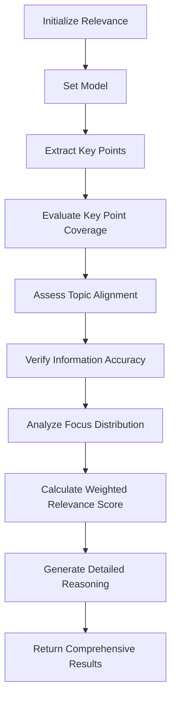

# Relevance

**Overview**  
Evaluates how well a summary captures and aligns with the most important content from its source text. Part of the **Content Evaluation** metric category.

```python
from indoxJudge.metrics import Relevance

# Initialize with texts to compare
relevance = Relevance(
    summary="Your summary here",
    source_text="Your source text here"
)
```

**Key Characteristics**  
**Property** | **Description**
--- | ---
**Detection Scope** | Key information coverage, topic alignment, information accuracy, focus distribution
**Score Range** | 0.0 (irrelevant) - 1.0 (highly relevant)
**Response Format** | Returns relevance score with key point coverage breakdown
**Dependencies** | Requires language model integration via `set_model()`

**Interpretation Guide**  
**Score Range** | **Interpretation**
--- | ---
0.0-0.2 | Off-topic or minimal relevance
0.2-0.4 | Tangentially relevant content
0.4-0.6 | Moderately relevant with key omissions
0.6-0.8 | Mostly relevant with good coverage
0.8-1.0 | Highly relevant with excellent alignment

**Usage Example**

```python
from indoxJudge.metrics import Relevance
from indoxJudge.models import YourLanguageModel

# Initialize the language model
llm = YourLanguageModel()

# Prepare source text and summary
source_text = "Paris is the capital of France, known for its rich history, art, and culture."
summary = "Paris, a global city in France, is renowned for its artistic heritage and cultural significance."

# Create Relevance instance
relevance_metric = Relevance(
    summary=summary,
    source_text=source_text,
    include_reason=True,
    weights={
        "key_information_coverage": 0.45,
        "topic_alignment": 0.35,
        "information_accuracy": 0.15,
        "focus_distribution": 0.05
    }
)

# Set the language model
relevance_metric.set_model(llm)

# Perform relevance evaluation
result = relevance_metric.measure()

# Access the results
print(f"""
Relevance Score: {result['score']:.2f}
Key Points Covered: {len([p for p in result['key_point_coverage'] if result['key_point_coverage'][p] > 0.5])}
Alignment Quality: {result['relevance_scores']['topic_alignment']:.2f}
""")
```

**Configuration Options**  
**Parameter** | **Effect**
--- | ---
`weights` | Customize importance weights for relevance aspects
`include_reason=True` | Enable detailed reasoning in evaluation output

**Best Practices**

1. **Balanced Weighting**: Adjust aspect weights based on summary purpose and context
2. **Comprehensive Analysis**: Enable reason inclusion for detailed evaluation insights
3. **Cross-Validation**: Compare relevance with other metrics like Factuality and InformationCoverage
4. **Target Audience**: Consider audience knowledge level when evaluating topic alignment

**Comparison Table**  
**Metric** | **Focus Area** | **Detection Method** | **Output Granularity**
--- | --- | --- | ---
`Relevance` | Content alignment | Multi-aspect analysis | Aspect-level scores
`InformationCoverage` | Information completeness | Category-based analysis | Category-level scores

**Limitations**

1. **Implicit Context**: May struggle with content requiring significant background knowledge
2. **Subjective Importance**: Key point importance can vary based on reader needs and context
3. **Format Sensitivity**: Works best with well-structured source documents
4. **Length Imbalance**: Performance may vary with extreme length differences

**Error Handling**  
**Common Issues** | **Recommended Action**
--- | ---
Aspect score inconsistency | Review and adjust aspect weights
Low scores with good summaries | Verify source text formatting
Model hallucinations | Enable stricter accuracy checking
Complex document structure | Pre-process with document segmentation

## Flow Chart


