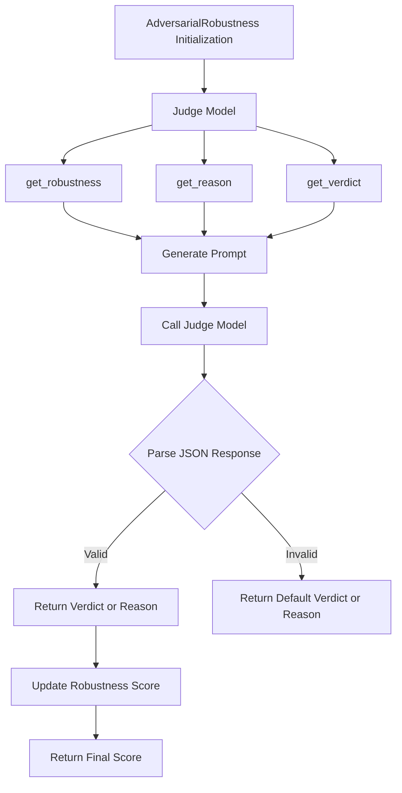

# AdversarialRobustness

Class for evaluating the adversarial robustness of language model outputs by analyzing the robustness score, reasons, and verdicts using a specified language model.

## Initialization

The `AdversarialRobustness` class is initialized with the following parameters:

- **input_sentence**: The sentence to be evaluated for adversarial robustness.

```python
class AdversarialRobustness:
    def __init__(
        self,
        input_sentence: str,
    ):
        """
        Initialize the AdversarialRobustness class to evaluate the robustness of language model outputs
        by analyzing various aspects including perturbation resistance and consistency.

        Parameters:
        input_sentence (str): The sentence to be evaluated for adversarial robustness.
        """
        self.model = None
        self.template = RobustnessTemplate()
        self.input_sentence = input_sentence
        self.robustness_score = 0
```

## Parameters Explanation

- **input_sentence**: The text input that needs to be evaluated for adversarial robustness.

## Usage Example

Here is an example of how to use the `AdversarialRobustness` class:

```python
from indoxJudge.metrics import AdversarialRobustness
from indoxJudge.pipelines import Evaluator

# Define a sample input sentence
input_sentence = "The model predicts that the likelihood of success is low."

# Initialize the AdversarialRobustness object
robustness = AdversarialRobustness(
    input_sentence=input_sentence
)

# Set up the evaluator
evaluator = Evaluator(model=language_model, metrics=[robustness])

# Get the evaluation results
results = evaluator.judge()
```

## Error Handling

The class implements comprehensive error handling for:

- Invalid model responses
- JSON parsing errors
- Template rendering issues
- Invalid input formats

## Flow Chart



## Notes

- The robustness evaluation considers multiple factors including semantic preservation, grammatical correctness, and logical consistency.
- The evaluation process uses the specified language model to generate adversarial examples and assess their impact.
- The class uses a default RobustnessTemplate for evaluation criteria and prompts.
