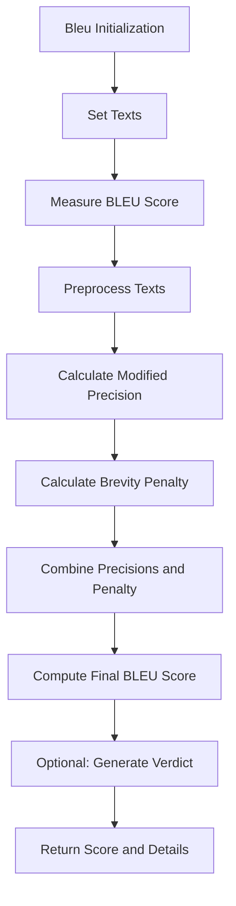

# BLEU Score

Class for evaluating the quality of generated text by comparing it to reference text using the BLEU (Bilingual Evaluation Understudy) metric.

## Initialization

```python
class Bleu:
    def __init__(
        self,
        summary: str,
        source: str,
        weights: List[float] = None,
        include_reason: bool = True,
    ):
```

## Hyperparameters

- **summary**: Generated text to be evaluated
- **source**: Original reference text for comparison
- **weights**: Weights for n-gram precisions (default: `[0.9, 0.1, 0.000, 0.000]`)
- **include_reason**: Whether to include detailed reasons in output (default: True)

## Usage Example

```python
from bleu import Bleu
from languagemodels import LanguageModel

# Initialize the language model
llm = LanguageModel()

# Prepare generated and reference texts
generated_text = "The quick brown fox jumps over the lazy dog."
reference_text = "A fast brown fox leaps above a sleepy canine."

# Create Bleu instance
bleu_metric = Bleu(
    summary=generated_text,
    source=reference_text,
    include_reason=True
)

# Set the language model
bleu_metric.set_model(llm)

# Perform BLEU score evaluation
result = bleu_metric.measure()

# Access the results
print(result['overall_score'])  # Overall BLEU score
print(result['detailed_scores'])  # Detailed BLEU metrics
print(result['verdict'])  # Textual explanation of translation quality
```

## Return Value

The `measure()` method returns a dictionary with:

- `overall_score`: BLEU score (0-1 range)
- `detailed_scores`: Comprehensive BLEU metric details
  - `score`: Overall BLEU score
  - `precisions`: Precision scores for different n-grams
  - `brevity_penalty`: Brevity penalty factor
  - `details`: Additional evaluation metrics
    - `matching_1grams`: Number of matching unigrams
    - `matching_2grams`: Number of matching bigrams
    - `total_generated_1grams`: Total generated unigrams
    - `generated_length`: Length of generated text
    - `reference_length`: Length of reference text
- `verdict`: Detailed textual explanation of translation quality (if `include_reason` is True)

## Key Features

- Precise text quality evaluation
- N-gram precision calculation
- Brevity penalty consideration
- Lemmatization-based preprocessing
- Flexible weighting of n-gram precisions
- Optional natural language explanation

## Preprocessing Techniques

- Lowercase conversion
- Special character removal
- Tokenization
- Lemmatization using WordNet
- N-gram extraction

## Computational Details

- Uses modified precision calculation
- Applies smoothing for higher-order n-grams
- Calculates brevity penalty
- Bounds final score between 0 and 1

## Logging

The class provides token usage tracking:

- Total input tokens
- Total output tokens
- Detailed token count information

## Error Handling

- Raises `ValueError` if:
  - Language model returns an empty response
- Robust preprocessing and scoring mechanism
- Graceful handling of text variations

## Extensibility

The class is designed to be easily extended:

- Customizable n-gram weights
- Flexible preprocessing
- Pluggable language model for verdicts

## Dependencies

- `nltk`: Natural Language Toolkit
- `pydantic`: Data validation
- `loguru`: Logging
- `json`: Response parsing
- `math`: Mathematical operations
- `re`: Regular expression processing

## Flow Chart



## Note

BLEU score provides a standardized method for evaluating text generation quality, particularly useful in machine translation, summarization, and text generation tasks. It captures the precision of n-grams between generated and reference texts while penalizing very short outputs.
