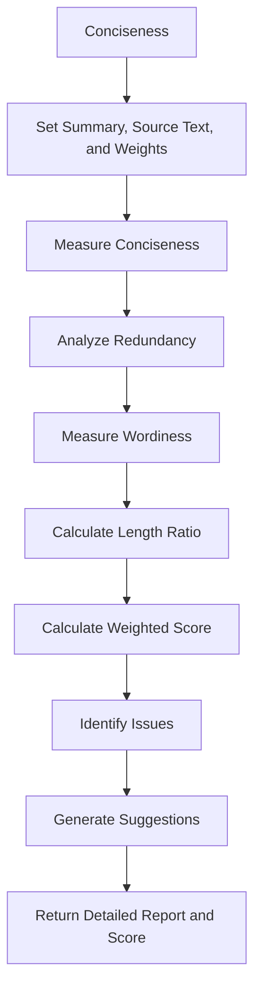

# Conciseness

Class for evaluating the conciseness of language model outputs by analyzing redundancy, wordiness, and length efficiency.

## Initialization

The `Conciseness` class is initialized with the following parameters:

- `summary`: The text to be evaluated for conciseness.
- `source_text`: Optional original text for comparison. Defaults to `None`.
- `target_length`: Optional target length for the summary. Defaults to `None`.
- `weights`: Optional dictionary to customize scoring weights. Defaults to `None`.
- `conciseness_threshold`: The threshold for determining conciseness. Defaults to `0.7`.

```python
class Conciseness:
    """
    Class for evaluating the conciseness of language model outputs by analyzing
    redundancy, wordiness, and length efficiency.
    """
    def __init__(
        self,
        summary: str,
        source_text: str = None,
        target_length: int = None,
        weights: Dict[str, float] = None,
        conciseness_threshold: float = 0.7,
    ):
        """
        Initializes the Conciseness class with the summary, source text, and evaluation settings.
        :param summary: The text to be evaluated for conciseness.
        :param source_text: Optional original text for comparison. Defaults to None.
        :param target_length: Optional target length for the summary. Defaults to None.
        :param weights: Optional dictionary to customize scoring weights. Defaults to None.
        :param conciseness_threshold: The threshold for determining conciseness. Defaults to 0.7.
        """
```

## Hyperparameters Explanation

- **summary**: A string containing the text to be evaluated for conciseness.
- **source_text**: An optional string representing the original text for comparative analysis. If provided, helps in assessing the summary's efficiency.
- **target_length**: An optional integer specifying the desired length of the summary, used to evaluate length efficiency.
- **weights**: A dictionary allowing customization of scoring weights. Default weights are:
  - `"redundancy"`: 0.4
  - `"wordiness"`: 0.4
  - `"length_ratio"`: 0.2
- **conciseness_threshold**: A float value representing the minimum conciseness score required. The default value is 0.7.

## Key Metrics

The `Conciseness` class provides detailed metrics:

1. **Redundancy Analysis**

   - Identifies repeated phrases
   - Detects redundant information
   - Generates a redundancy score

2. **Wordiness Metrics**

   - Counts total words
   - Calculates average sentence length
   - Identifies filler words
   - Detects complex phrases
   - Generates a wordiness score

3. **Length Efficiency**
   - Compares summary length to source text
   - Calculates length ratio score

## Usage Example

```python
from indoxJudge.metrics import Conciseness
from indoxJudge.models import YourLanguageModel

# Initialize the language model
llm = YourLanguageModel()

# Define the summary and source text
summary = "Paris is the capital of France, located in France."
source_text = "Paris is the beautiful capital of the European country France, situated in Western Europe."

# Initialize the Conciseness metric
conciseness_metric = Conciseness(
    summary=summary,
    source_text=source_text,
    target_length=50,  # Optional target length
    weights={"redundancy": 0.5, "wordiness": 0.3, "length_ratio": 0.2},  # Optional custom weights
    conciseness_threshold=0.7
)

# Set the language model
conciseness_metric.set_model(llm)

# Measure conciseness
result = conciseness_metric.measure()
print(result)
```

## Return Value

The `measure()` method returns a detailed dictionary with:

- `overall_score`: Weighted conciseness score
- `metrics`: Breakdown of redundancy, wordiness, and length ratio scores
- `issues`: Specific conciseness issues found
- `suggestions`: Recommendations for improving conciseness

## Flow Chart



## Key Features

- Identifies and quantifies redundancy
- Highlights wordiness and complex language
- Provides actionable improvement suggestions
- Flexible scoring with customizable weights
- Supports comparative analysis with source text
