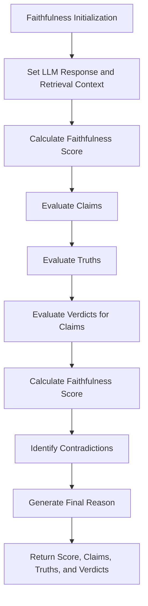

# Faithfulness

Class for evaluating the faithfulness of language model outputs by analyzing claims, truths, verdicts, and reasons using a specified language model.

## Initialization

The `Faithfulness` class is initialized with the following parameters:

- **llm_response**: The response generated by the language model.
- **retrieval_context**: The context used for retrieval during evaluation.

```python
class Faithfulness:
    """
    Class for evaluating the faithfulness of language model outputs by analyzing
    claims, truths, verdicts, and reasons using a specified language model.
    """
    def __init__(self, llm_response, retrieval_context):
        """
        Initializes the Faithfulness class with the LLM response and retrieval context.

        :param llm_response: The response generated by the language model.
        :param retrieval_context: The context used for retrieval during evaluation.
        """
```

# Hyperparameters Explanation

- **llm_response**: The response from the language model that needs to be evaluated for faithfulness.

- **retrieval_context**: The context or reference information used to verify the truthfulness and accuracy of the language model's output.

# Usage Example

Here is an example of how to use the `Faithfulness` class:

```python
import os
from dotenv import load_dotenv
from indoxJudge.models import OpenAi
from indoxJudge.metrics import Faithfulness
from indoxJudge.pipelines import Evaluator

load_dotenv()
OPENAI_API_KEY = os.getenv("OPENAI_API_KEY")

# Initialize the language model
# it can be any OpenAI model, please refer to the [OpenAI Models documentation](https://platform.openai.com/docs/models) such as GPT-4o.

llm = OpenAi(api_key=OPENAI_API_KEY, model="Open AI Model")

# Define the LLM response and retrieval context to be evaluated
llm_response = "Paris is the capital of Germany."
retrieval_context = "Paris is the capital of France."

# Initialize the Faithfulness metric
faithfulness_metric = Faithfulness(llm_response=llm_response, retrieval_context=retrieval_context)

# Create an evaluator with the Faithfulness metric
evaluator = Evaluator(model=llm, metrics=[faithfulness_metric])
result = evaluator.judge()
```

## Flow Chart


