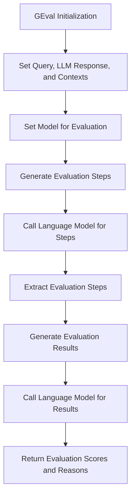

# GEval

Class for evaluating various aspects of language model outputs, including retrieval quality, integration, coherence, relevance, accuracy, fluency, comprehensiveness, and contextuality.

## Initialization

The `GEval` class is initialized with the following parameters:

- **parameters**: The parameters or aspects to evaluate (e.g., 'summary', 'dialogue').
- **query**: The original query or input text.
- **llm_response**: The response generated by the language model.
- **ground_truth**: The expected or correct output.
- **context**: Additional context relevant to the query.
- **retrieval_context**: The context from which information was retrieved.

```python
class GEval:
    def __init__(self, parameters, query, llm_response, ground_truth, context, retrieval_context):
        """
        Initialize the GEval class with necessary inputs for evaluation.

        Parameters:
        parameters (str): The parameters or aspects to evaluate (e.g., 'summary', 'dialogue').
        query (str): The original query or input text.
        llm_response (str): The response generated by the language model.
        ground_truth (str): The expected or correct output.
        context (str): Additional context relevant to the query.
        retrieval_context (str): The context from which information was retrieved.
        """

        self.criteria = """
        1. Retrieval Quality: The retrieved documents or snippets should be relevant and accurate.
        2. Integration: The retrieved information should be well integrated into the generated response.
        3. Coherence: The text should be logically structured and easy to follow.
        4. Relevance: The text should be relevant to the main topic and cover all key points.
        5. Accuracy: The text should be factually accurate and consistent with the source material.
        6. Fluency: The text should be easy to read and free from grammatical errors.
        7. Comprehensiveness: The text should cover all key points and provide a thorough response.
        8. Contextuality: The response should fit well within the context of the query.
        """
```

# Parameters Explanation

- **parameters**: Specifies the aspects to evaluate, such as 'summary', 'dialogue', etc.
- **query**: The initial question or input provided for generating the response.
- **llm_response**: The actual response generated by the language model that needs evaluation.
- **ground_truth**: The correct or expected answer for comparison.
- **context**: Any additional background or context related to the query.
- **retrieval_context**: Information retrieved that helps in generating the response, serving as a reference.

# Evaluation Criteria

The evaluation is based on several criteria, which include:

- **Retrieval Quality**: The relevance and accuracy of the retrieved documents or snippets.
- **Integration**: How well the retrieved information is integrated into the generated response.
- **Coherence**: The logical structure and ease of following the text.
- **Relevance**: The pertinence of the text to the main topic and completeness in covering key points.
- **Accuracy**: The factual correctness and consistency of the text with the source material.
- **Fluency**: The readability and grammatical correctness of the text.
- **Comprehensiveness**: The thoroughness of the text in covering all key points.
- **Contextuality**: The appropriateness of the response within the context of the query.

# Usage Example

Here is an example of how to use the `GEval` class:

```python
import os
from dotenv import load_dotenv
from indoxJudge.models import OpenAi
from indoxJudge.metrics import GEval
from indoxJudge.pipelines import Evaluator

load_dotenv()
OPENAI_API_KEY = os.getenv("OPENAI_API_KEY")


# Initialize the language model
# it can be any OpenAI model, please refer to the [OpenAI Models documentation](https://platform.openai.com/docs/models) such as GPT-4o.

llm = OpenAi(api_key=OPENAI_API_KEY, model="Open AI Model")

# Define the necessary inputs for evaluation
query = "What are the main benefits of a plant-based diet?"
llm_response = "A plant-based diet can improve heart health, aid in weight loss, and reduce the risk of chronic diseases."
ground_truth = "A plant-based diet is known for its benefits like improving cardiovascular health, aiding weight loss, and reducing the risk of chronic diseases such as diabetes and cancer."
context = "Plant-based diets are associated with lower levels of cholesterol and blood pressure."
retrieval_context = "Studies have shown that plant-based diets can lower the risk of heart disease and obesity."

# Initialize the GEval metric
geval_metric = GEval(
    parameters="summary",
    query=query,
    llm_response=llm_response,
    ground_truth=ground_truth,
    context=context,
    retrieval_context=retrieval_context
)

# Create an evaluator with the GEval metric
evaluator = Evaluator(model=llm, metrics=[geval_metric])
result = evaluator.judge()
```

## Flow Chart


