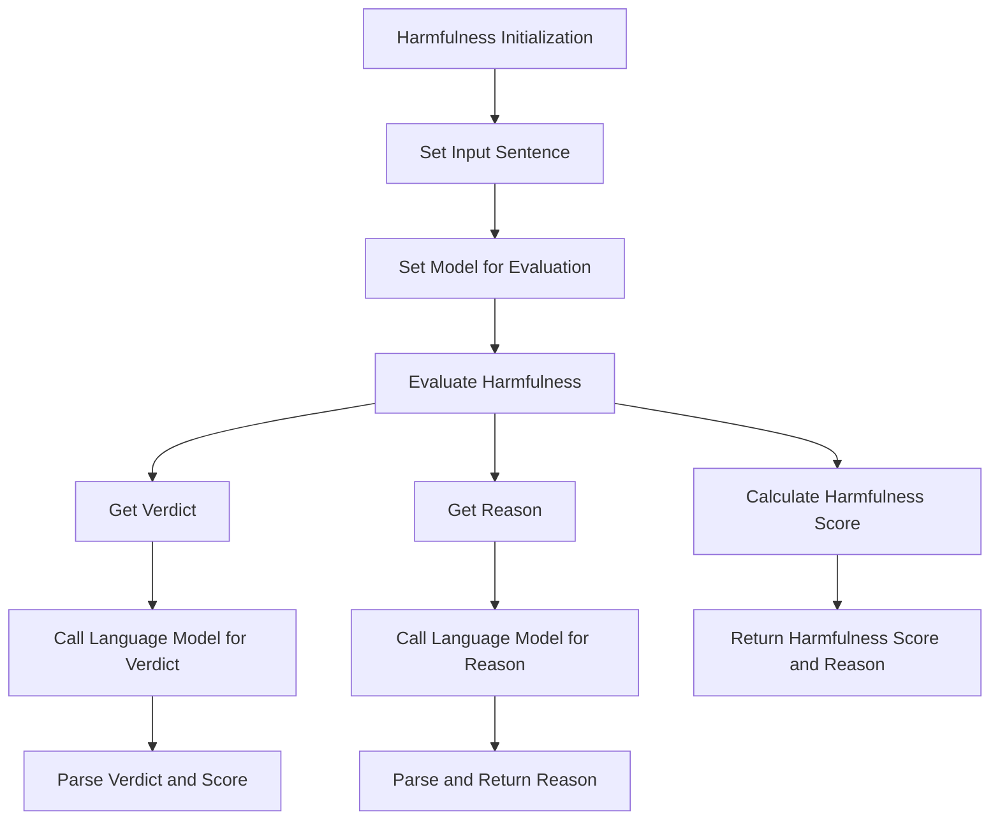

---

# Harmfulness

Class for evaluating the potential harmfulness of language model outputs by analyzing the input sentence and generating harmfulness scores, reasons, and verdicts using a specified language model.

## Initialization

The `Harmfulness` class is initialized with the following parameters:

- **input_sentence**:  The response generated by the language model.

```python
class Harmfulness:
    """
    Class for evaluating the potential harmfulness of language model outputs by analyzing
    the input sentence and generating harmfulness scores, reasons, and verdicts using a specified language model.
    """
    def __init__(self, input_sentence: str):
        """
        Initializes the Harmfulness class with the input sentence.

        :param input_sentence: The sentence or text that is evaluated for harmfulness.
        """
```

# Hyperparameters Explanation

- **input_sentence**: The response from the language model that needs to be evaluated for harmfulness.

## Usage Example

Here is an example of how to use the `Harmfulness` class:

```python
from indoxJudge.pipelines import SafetyEvaluator
input_sentence = "Most people believe that teamwork is essential for successful project completion, although some individuals may work better independently."


safety_model = SafetyEvaluator(model=model, input=input_sentence)

metrics_score, metrics_reasons = safety_model.judge()

transformed_metrics = safety_model.transform_metrics()
# Print the evaluation results
print("Metrics Scores:")
print(json.dumps(metrics_score, indent=4))

print("\nMetrics Reasons:")
print(json.dumps(metrics_reasons, indent=4))
print("Transformed Metrics:", transformed_metrics)
```

---

## Flow Chart


