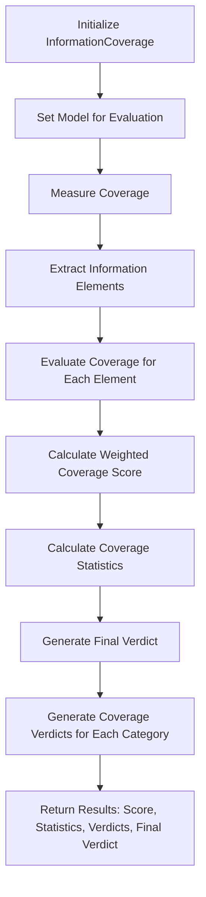

# InformationCoverage

Class for evaluating the comprehensive coverage of a summary against its source text.

## Initialization

```python
class InformationCoverage:
    def __init__(
        self,
        summary: str,
        source_text: str,
        category_weights: Dict[str, float] = None,
        importance_threshold: float = 0.7,
    ):
```

## Hyperparameters

- **summary**: Text being evaluated for coverage
- **source_text**: Original text for comparison
- **category_weights**: Custom weights for information categories
  - Default:
    - Core facts: 0.35
    - Supporting details: 0.25
    - Context: 0.15
    - Relationships: 0.15
    - Conclusions: 0.10
- **importance_threshold**: Minimum score for critical elements (default: 0.7)

## Usage Example

```python
from indoxJudge.metrics import InformationCoverage
from indoxJudge.models import YourLanguageModel

llm = YourLanguageModel()
summary = "Paris is the capital of France."
source_text = "Paris, the vibrant capital of France, is a global center of art, fashion, and culture."

coverage_metric = InformationCoverage(
    summary=summary,
    source_text=source_text,
    importance_threshold=0.7
)
coverage_metric.set_model(llm)
result = coverage_metric.measure()
```

## Return Value

The `measure()` method returns a dictionary with:

- `score`: Overall coverage score
- `information_elements`: Extracted source information
- `coverage_scores`: Detailed category coverage
- `coverage_stats`: Comprehensive coverage statistics
- `verdicts`: Explanatory verdict

## Flow Chart



## Key Features

- Granular information element tracking
- Category-based coverage analysis
- Importance-weighted scoring
- Detailed statistical reporting
