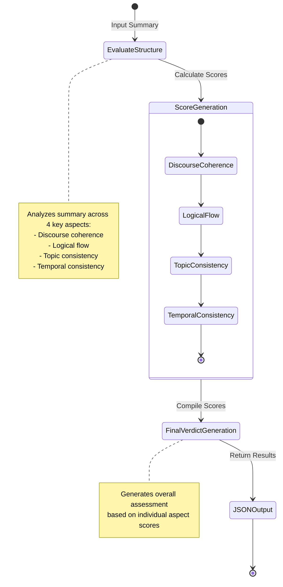

# StructureQuality

Class for evaluating the structural quality of a summary through comprehensive analysis of its coherence, logical flow, and consistency.

## Initialization

```python
class StructureQuality:
    def __init__(
        self,
        summary: str,
        weights: Dict[str, float] = None,
    ):
```

## Hyperparameters

- **summary**: Summary text being evaluated for structural quality
- **weights**: Custom weights for different structural aspects
  - Default:
    - Discourse Coherence: 0.3
    - Logical Flow: 0.3
    - Topic Consistency: 0.2
    - Temporal Consistency: 0.2

## Usage Example

```python
from structure_quality import StructureQuality
from languagemodels import LanguageModel

# Initialize the language model
llm = LanguageModel()

# Prepare summary
summary = "Climate change is a global challenge. Rising temperatures affect ecosystems. Renewable energy offers solutions."

# Create StructureQuality instance
structure_metric = StructureQuality(
    summary=summary,
    weights={
        "discourse_coherence": 0.35,
        "logical_flow": 0.25,
        "topic_consistency": 0.25,
        "temporal_consistency": 0.15
    }
)

# Set the language model
structure_metric.set_model(llm)

# Perform structure quality evaluation
result = structure_metric.measure()

# Access the results
print(result['score'])  # Overall structure quality score
print(result['verdicts'])  # Detailed verdicts for each structural aspect
print(result['reason'])  # Textual explanation of the score
```

## Return Value

The `measure()` method returns a dictionary with:

- `score`: Overall structure quality score (0-1 range)
- `verdicts`: List of structural aspect verdicts
  - Each verdict contains:
    - `aspect`: Specific structural aspect evaluated
    - `score`: Score for that aspect
    - `reason`: Explanation of the score
- `reason`: Detailed textual explanation of the overall score

## Key Features

- Multi-aspect structural analysis
- Customizable evaluation weights
- Comprehensive structural quality assessment
- Detailed scoring and reasoning
- Flexible language model integration

## Dependencies

- `typing`: For type hinting
- `pydantic`: For data validation
- `loguru`: For logging
- `json`: For response parsing

## Logging

The class logs token usage information, including:

- Total input tokens
- Total output tokens
- Total token count used during evaluation

## Error Handling

- Raises `ValueError` if the language model returns an empty response
- Provides flexible error handling for JSON parsing
- Supports custom weight configuration

## Extensibility

The class is designed to be easily extended:

- Custom weight configuration
- Pluggable language model
- Flexible prompt templates
- Detailed logging and tracking

## Flow Chart


