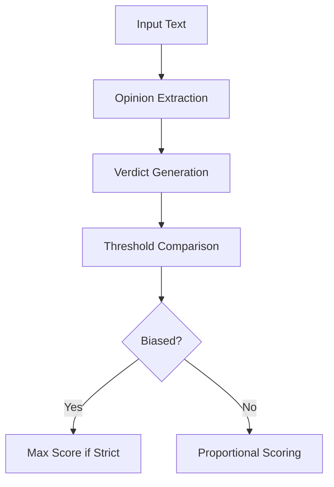

## Bias

### Overview

Detects general language bias patterns in text outputs through opinion analysis. Part of the Bias & Fairness category.

```python
from indoxJudge.metrics import Bias

# Initialize with response and settings
bias_check = Bias(llm_response=your_text, threshold=0.6)
```

### Key Characteristics

| Property        | Description                                                 |
| --------------- | ----------------------------------------------------------- |
| Detection Scope | Opinion-based bias, subjective language patterns            |
| Score Range     | 0.0 (neutral) - 1.0 (biased)                                |
| Analysis Depth  | Opinion extraction → Verdict generation → Score calculation |
| Configuration   | Adjustable threshold and strict mode                        |

### Interpretation Guide

| Score Range | Interpretation         |
| ----------- | ---------------------- |
| 0.0-0.3     | Neutral/Objective      |
| 0.3-0.6     | Mildly opinionated     |
| 0.6-0.8     | Clear bias present     |
| 0.8-1.0     | Strong systematic bias |

### Usage Example

```python
bias_metric = Bias(
    llm_response="This political ideology is fundamentally flawed",
    threshold=0.4,
    include_reason=True
)

evaluator = Evaluator(model=llm, metrics=[bias_metric])
results = evaluator.judge()

print(f"Bias Confidence: {results['bias']['score']:.2f}")
```

### Configuration Options

| Parameter      | Effect                                  |
| -------------- | --------------------------------------- |
| threshold=0.5  | Sensitivity level for bias flagging     |
| include_reason | Toggles explanatory rationale in output |

### Evaluation Process


