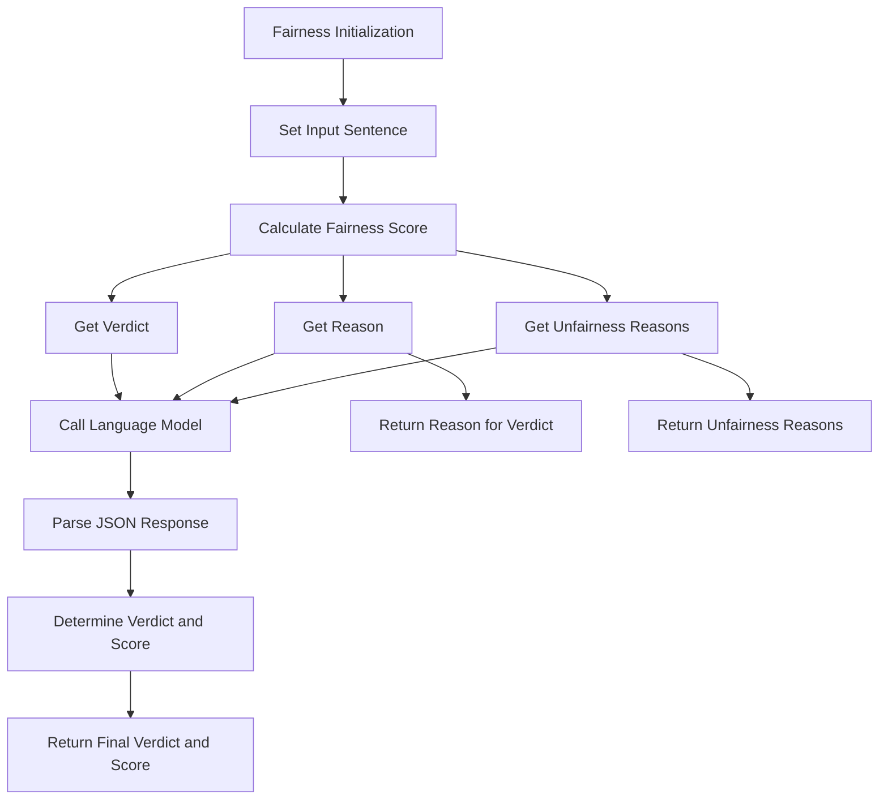

**Fairness**

**Overview**  
Assesses overall fairness in text outputs by detecting discriminatory patterns and systemic biases. Part of the **Bias & Fairness** metric category.

```python
from indoxJudge.metrics import Fairness

# Initialize with text to analyze
fairness_check = Fairness(input_sentence="Your text here")
```

**Key Characteristics**  
**Property** | **Description**
--- | ---
**Detection Scope** | Systemic biases, demographic discrimination, exclusionary language
**Score Range** | 0.0 (fair) - 1.0 (unfair)
**Response Format** | Returns fairness score with violation flags and rationale
**Dependencies** | Requires language model integration via `set_model()`

**Interpretation Guide**  
**Score Range** | **Interpretation**
--- | ---
0.0-0.2 | No detectable fairness issues
0.2-0.4 | Potential indirect bias
0.4-0.6 | Moderate exclusionary patterns
0.6-0.8 | Clear discriminatory content
0.8-1.0 | Severe systemic bias

**Usage Example**

```python
from indoxJudge.metrics import Fairness
from indoxJudge.pipelines import Evaluator

text = "Preferred candidates will be under 35 and native English speakers"

# Initialize analyzer
fairness = Fairness(input_sentence=text)

# Use in evaluation pipeline
evaluator = Evaluator(
    model=your_model,
    metrics=[fairness]
)

results = evaluator.judge()

# Access comprehensive report
print(f"""
Fairness Score: {results['fairness']['score']:.2f}
Reason: {results['fairness']['reason']}
""")
```

**Configuration Options**  
**Parameter** | **Effect**
--- | ---
`threshold=0.65` | Adjust fairness alert threshold (default: 0.65)
Custom Templates | Modify detection criteria for specific fairness frameworks

**Best Practices**

1. **Combine Metrics**: Use with `StereotypeBias` and `ContextualRelevancy` for layered analysis
2. **Context Anchoring**: Provide demographic context when available
3. **Threshold Strategy**: Lower threshold (0.5) for HR/recruitment applications
4. **Bias Validation**: Cross-check with demographic parity statistics

**Comparison Table**  
**Metric** | **Focus Area** | **Detection Method** | **Output Granularity**
--- | --- | --- | ---
`Fairness` | Systemic discrimination | Statistical patterns | Score + Violation types
`StereotypeBias` | Cultural stereotypes | Semantic analysis | Specific stereotype tags
`Bias` | General model skew | Distribution analysis | Binary classification

**Limitations**

1. **Statistical Blindspots**: May miss individual-level unfairness
2. **Context Dependency**: Requires clear reference groups for accurate assessment
3. **Language Nuance**: Challenges with implied biases through sarcasm/humor
4. **Framework Bias**: Reflects training data's fairness definitions

**Error Handling**  
**Common Issues** | **Recommended Action**
--- | ---
Ambiguous statements | Add demographic context
Multiple protected classes | Use intersectional analysis tools
Cultural specificity gaps | Supplement with locale-specific dictionaries
Model confidence conflicts | Enable verbose logging for audit

## Flow Chart


