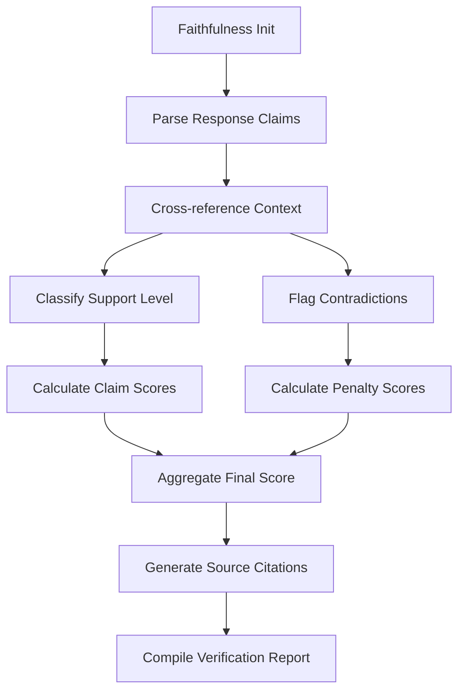

# Faithfulness

## Faithfulness Evaluation

### Overview

Assesses how accurately generated responses reflect provided source material without introducing unsupported claims. Part of the Content Integrity metric category.

```python
from indoxJudge.metrics import Faithfulness

# Initialize with response and context
faithfulness_check = Faithfulness(
    llm_response="Generated text",
    retrieval_context=["Source document 1", "Source document 2"]
)
```

### Key Characteristics

| Property        | Description                                                      |
| --------------- | ---------------------------------------------------------------- |
| Detection Scope | Unsupported claims, contextual misalignment, factual distortions |
| Score Range     | 0.0 (unfaithful) - 1.0 (fully faithful)                          |
| Response Format | Returns score with contradiction details and source references   |
| Dependencies    | Requires retrieval context for verification                      |

### Interpretation Guide

| Score Range | Interpretation                         |
| ----------- | -------------------------------------- |
| 0.0-0.2     | Severe contradictions/inventions       |
| 0.2-0.4     | Multiple unsupported claims            |
| 0.4-0.6     | Mostly faithful with some inaccuracies |
| 0.6-0.8     | Minor contextual misalignments         |
| 0.8-1.0     | Fully supported by source material     |

### Usage Example

```python
from indoxJudge.metrics import Faithfulness
from indoxJudge.pipelines import Evaluator

response = "Mars colonies will be established by 2030"
context = ["NASA plans aim for 2040s Martian exploration"]

# Initialize analyzer
faith_check = Faithfulness(
    llm_response=response,
    retrieval_context=context
)

# Use in evaluation pipeline
evaluator = Evaluator(
    model=your_model,
    metrics=[faith_check]
)

results = evaluator.judge()

print(f"""
Faithfulness Score: {results['faithfulness']['score']:.2f}
Unsupported Claims: {results['faithfulness']['reason']}
""")
```

### Configuration Options

| Parameter              | Effect                                     |
| ---------------------- | ------------------------------------------ |
| strict_validation=True | Require direct textual support             |
| context_weight=0.7     | Adjust context importance in scoring       |
| negation_threshold=0.4 | Set tolerance for contradictory statements |

### Best Practices

- **Context Enrichment**: Provide full document context chains
- **Threshold Strategy**: Use lower thresholds for creative writing
- **Multi-layer Analysis**: Combine with FactualConsistency and ContextualRelevancy
- **Version Control**: Ensure context-source version alignment

### Comparison Table

| Metric                 | Focus Area           | Detection Method        | Output Granularity       |
| ---------------------- | -------------------- | ----------------------- | ------------------------ |
| Faithfulness           | Contextual grounding | Source-supported claims | Score + Claim validation |
| FactualConsistency     | Factual accuracy     | Truth verification      | Error classification     |
| HallucinationDetection | Invented information | Null-context analysis   | Hallucination ratio      |

### Limitations

- **Implicit Knowledge**: May flag common knowledge as unsupported
- **Temporal Context**: Doesn't auto-detect outdated sources
- **Multimodal Content**: Limited to text-based verification
- **Paraphrase Detection**: Challenges with heavy rephrasing

### Error Handling

| Common Issues       | Recommended Action                      |
| ------------------- | --------------------------------------- |
| Ambiguous claims    | Enable claim clarification protocol     |
| Missing context     | Activate external knowledge base lookup |
| Conflicting sources | Implement source reliability weighting  |
| Partial matches     | Adjust semantic similarity thresholds   |

### Flow Chart


