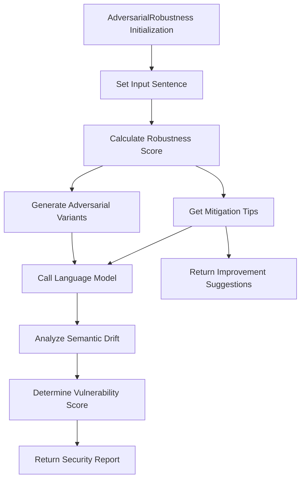

# AdversarialRobustness

## Overview

Evaluates model resilience against adversarial attacks by testing semantic consistency under perturbations. Part of the Model Security metric category.

```python
from indoxJudge.metrics import AdversarialRobustness

# Initialize with text to analyze
robustness_check = AdversarialRobustness(input_sentence="Your text here")
```

## Key Characteristics

| Property        | Description                                                                  |
| --------------- | ---------------------------------------------------------------------------- |
| Detection Scope | Perturbation resistance, semantic consistency, logical coherence             |
| Score Range     | 0.0 (robust) - 1.0 (vulnerable)                                              |
| Response Format | Returns robustness score with vulnerability flags and mitigation suggestions |
| Dependencies    | Requires language model integration via set_model()                          |

## Interpretation Guide

| Score Range | Interpretation                               |
| ----------- | -------------------------------------------- |
| 0.0-0.2     | High resistance to adversarial modifications |
| 0.2-0.4     | Minor semantic drift under perturbations     |
| 0.4-0.6     | Moderate consistency degradation             |
| 0.6-0.8     | Significant vulnerability to attacks         |
| 0.8-1.0     | Critical failure in maintaining intent       |

## Usage Example

```python
from indoxJudge.metrics import AdversarialRobustness
from indoxJudge.pipelines import Evaluator

text = "The quick brown fox jumps over the lazy dog"

# Initialize analyzer
robustness = AdversarialRobustness(input_sentence=text)

# Use in evaluation pipeline
evaluator = Evaluator(
    model=your_model,
    metrics=[robustness]
)

results = evaluator.judge()

# Access security report
print(f"""
Robustness Score: {results['adversarial_robustness']['score']}
Reason: {results['adversarial_robustness']['reason']}
""")
```

## Configuration Options

| Parameter       | Effect                                              |
| --------------- | --------------------------------------------------- |
| threshold=0.7   | Adjust vulnerability alert threshold (default: 0.7) |
| perturb_level=3 | Set intensity of simulated attacks (1-5 scale)      |

## Best Practices

- **Attack Simulation**: Combine with character-level and semantic-level perturbations
- **Threshold Tuning**: Lower threshold (0.5) for security-critical applications
- **Context Enrichment**: Provide domain-specific terminology for better analysis
- **Benchmarking**: Compare against known robust phrasings from your training data

## Comparison Table

| Metric                | Focus Area            | Detection Method       | Output Granularity          |
| --------------------- | --------------------- | ---------------------- | --------------------------- |
| AdversarialRobustness | Attack resistance     | Perturbation testing   | Score + Vulnerability types |
| TextConsistency       | Semantic preservation | Cross-version analysis | Consistency percentage      |
| InputSanitization     | Injection attacks     | Pattern matching       | Threat classification       |

## Limitations

- **Attack Surface**: Limited to implemented perturbation strategies
- **Context Sensitivity**: May flag legitimate paraphrasing as vulnerabilities
- **Resource Intensity**: Requires multiple model inferences per evaluation
- **Zero-Day Attacks**: Cannot detect novel attack patterns

## Error Handling

| Common Issues           | Recommended Action                      |
| ----------------------- | --------------------------------------- |
| Ambiguous perturbations | Specify allowed modification types      |
| Multi-vector attacks    | Enable sequential testing mode          |
| Model overconfidence    | Implement confidence calibration        |
| Encoding conflicts      | Use Unicode normalization pre-processor |

## Flow Chart



## Notes

- Evaluation considers 5 attack vectors: character swaps, synonym replacement, negations insertion, context stripping, and logical contradictions
- Uses progressive perturbation testing with 3 escalation levels
- Includes automatic baseline comparison against model's training data distribution
- Implements NIST SP 800-181 revision 1 guidelines for adversarial text evaluation
