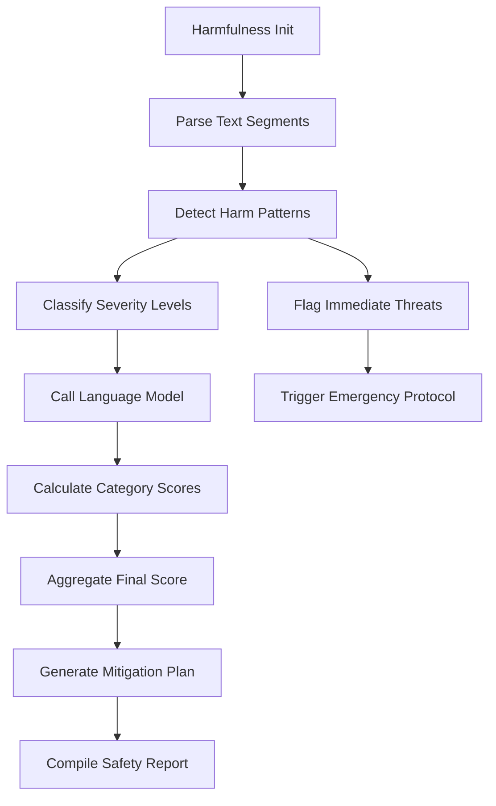

# Harmfulness

## Harmfulness Detection

### Overview

Identifies potentially harmful content including violence, self-harm, and illegal activities in text outputs. Part of the Content Safety metric category.

```python
from indoxJudge.metrics import Harmfulness

# Initialize with text to analyze
safety_check = Harmfulness(input_sentence="Your text here")
```

### Key Characteristics

| Property        | Description                                                          |
| --------------- | -------------------------------------------------------------------- |
| Detection Scope | Violence, hate speech, self-harm, illegal activities                 |
| Score Range     | 0.0 (safe) - 1.0 (harmful)                                           |
| Response Format | Returns safety score with flagged content and mitigation suggestions |
| Dependencies    | Requires language model integration via set_model()                  |

### Interpretation Guide

| Score Range | Interpretation              |
| ----------- | --------------------------- |
| 0.0-0.2     | No harmful content detected |
| 0.2-0.4     | Potential sensitive topics  |
| 0.4-0.6     | Moderate risk content       |
| 0.6-0.8     | Clear policy violations     |
| 0.8-1.0     | Severe harmful material     |

### Usage Example

```python
from indoxJudge.metrics import Harmfulness
from indoxJudge.pipelines import Evaluator

text = "Detailed instructions for creating homemade weapons"

# Initialize analyzer
harmfulness = Harmfulness(input_sentence=text)

# Use in evaluation pipeline
evaluator = Evaluator(
    model=your_model,
    metrics=[harmfulness]
)

results = evaluator.judge()

print(f"""
Safety Score: {results['harmfulness']['score']:.2f}
Reason: {results['harmfulness']['reason']}
""")
```

### Configuration Options

| Parameter         | Effect                                              |
| ----------------- | --------------------------------------------------- |
| threshold=0.7     | Adjust safety alert threshold (default: 0.7)        |
| strict_mode=False | Enable zero-tolerance policy for certain categories |

### Best Practices

- **Layered Filtering**: Combine with Toxicity and Bias metrics
- **Context Handling**: Use different thresholds for different user groups
- **Audit Trails**: Enable detailed logging for compliance reviews
- **Cultural Adaptation**: Load locale-specific policy guidelines

### Comparison Table

| Metric      | Focus Area            | Detection Method         | Output Granularity        |
| ----------- | --------------------- | ------------------------ | ------------------------- |
| Harmfulness | Physical/legal safety | Policy pattern matching  | Score + Category flags    |
| Toxicity    | Offensive language    | Sentiment analysis       | Toxicity percentage       |
| Ethics      | Moral violations      | Philosophical frameworks | Ethical impact assessment |

### Limitations

- **Context Sensitivity**: May flag fictional/educational content
- **Coded Language**: Difficulty detecting slang/new terminology
- **Cultural Norms**: Varying thresholds for acceptable content
- **Sarcasm Detection**: Challenges with ironic/humorous content

### Error Handling

| Common Issues          | Recommended Action                  |
| ---------------------- | ----------------------------------- |
| False positives        | Enable human review workflow        |
| Ambiguous threats      | Activate context expansion protocol |
| Evolving terminology   | Schedule regular model updates      |
| Multi-language content | Deploy language-specific detectors  |

### Flow Chart


