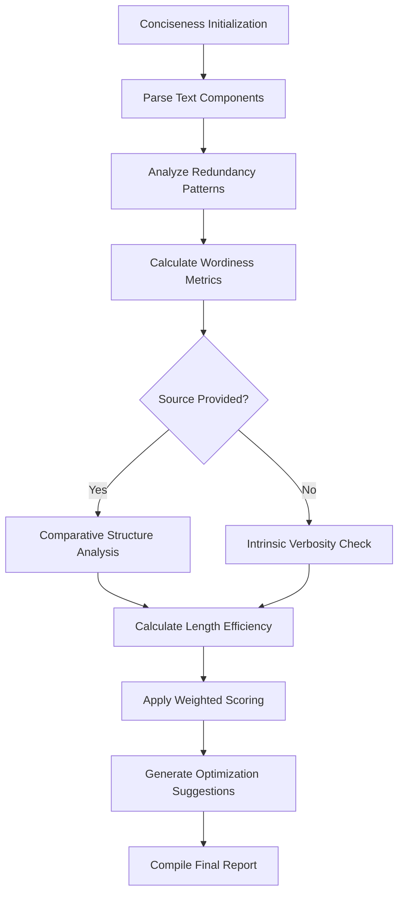

# Conciseness Evaluation

## Overview

Assesses text compression efficiency and elimination of redundancy while preserving core meaning. Part of the Text Quality metric category.

```python
from indoxJudge.metrics import Conciseness

# Initialize with summary to evaluate
conciseness_check = Conciseness(
    summary="Your text here",
    source_text="Original reference (optional)"
)
```

## Key Characteristics

| Property        | Description                                                     |
| --------------- | --------------------------------------------------------------- |
| Detection Scope | Verbosity, redundancy, length efficiency                        |
| Score Range     | 0.0 (wordy) - 1.0 (concise)                                     |
| Response Format | Returns score with verbosity flags and optimization suggestions |
| Dependencies    | Optional source text for comparative analysis                   |

## Interpretation Guide

| Score Range | Interpretation                 |
| ----------- | ------------------------------ |
| 0.0-0.2     | Severely redundant/wordy       |
| 0.2-0.4     | Multiple unnecessary elements  |
| 0.4-0.6     | Acceptable with some verbosity |
| 0.6-0.8     | Mostly concise                 |
| 0.8-1.0     | Optimal information density    |

## Usage Example

```python
from indoxJudge.metrics import Conciseness
from indoxJudge.pipelines import Evaluator

summary = "Paris is the capital city of France, located in France."
source = "Paris, the vibrant capital of France, is situated in Western Europe..."

# Initialize analyzer
conciseness = Conciseness(
    summary=summary,
    source_text=source,
    weights={"redundancy": 0.6, "wordiness": 0.3},
    target_length=30
)

# Use in evaluation pipeline
evaluator = Evaluator(
    model=your_model,
    metrics=[conciseness]
)

results = evaluator.judge()

# Access comprehensive report
print(f"""
Conciseness Score: {results['conciseness']['score']:.2f}
Redundant Phrases: {results['conciseness']['redundancies']}
Optimization Tips: {results['conciseness']['suggestions']}
""")
```

## Configuration Options

| Parameter              | Effect                                                                           |
| ---------------------- | -------------------------------------------------------------------------------- |
| weights                | Customize metric importance (default: redundancy=0.4, wordiness=0.4, length=0.2) |
| target_length          | Set ideal response length threshold                                              |
| strict_comparison=True | Enable deep structural analysis with source text                                 |

## Best Practices

- **Context Weighting**: Increase redundancy weights for technical documentation
- **Length Targets**: Set character limits for domain-specific responses
- **Multi-metric Analysis**: Combine with Clarity and Coherence evaluations
- **Iterative Tuning**: Adjust weights based on audience reading levels

## Comparison Table

| Metric         | Focus Area           | Detection Method                        | Output Granularity         |
| -------------- | -------------------- | --------------------------------------- | -------------------------- |
| Conciseness    | Information density  | Pattern matching + comparative analysis | Score + Redundancy list    |
| Brevity        | Pure length          | Character/word count                    | Length percentage          |
| Simplification | Complexity reduction | Readability scores                      | Simplification suggestions |

## Limitations

- **Context Sensitivity**: May flag intentional repetition for emphasis
- **Cultural Variations**: Different norms for acceptable verbosity
- **Technical Texts**: Higher natural redundancy in scientific content
- **Multilingual Support**: Varying redundancy thresholds per language

## Error Handling

| Common Issues        | Recommended Action                      |
| -------------------- | --------------------------------------- |
| Missing source text  | Activate intrinsic redundancy detection |
| Custom weight errors | Auto-normalize weight distributions     |
| Length mismatches    | Enable adaptive length scoring          |
| Ambiguous phrases    | Use context-aware parsing               |

## Flow Chart


