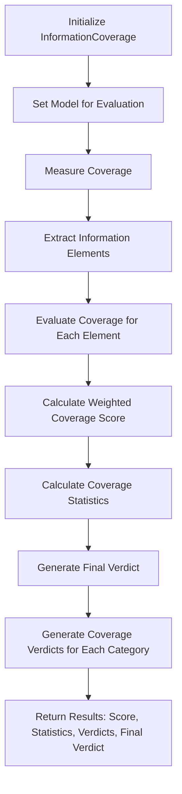

**Information Coverage**

**Overview**  
Evaluates how comprehensively a summary captures key information from its source text. Part of the **Content Evaluation** metric category.

```python
from indoxJudge.metrics import InformationCoverage

# Initialize with texts to compare
coverage = InformationCoverage(
    summary="Your summary here",
    source_text="Your source text here"
)
```

**Key Characteristics**  
**Property** | **Description**
--- | ---
**Detection Scope** | Core facts, supporting details, context, relationships, conclusions
**Score Range** | 0.0 (no coverage) - 1.0 (complete coverage)
**Response Format** | Returns coverage score with detailed category breakdowns
**Dependencies** | Requires language model integration via `set_model()`

**Interpretation Guide**  
**Score Range** | **Interpretation**
--- | ---
0.0-0.2 | Minimal information preservation
0.2-0.4 | Basic fact retention only
0.4-0.6 | Moderate coverage of key elements
0.6-0.8 | Comprehensive core information
0.8-1.0 | Complete information preservation

**Usage Example**

```python
from indoxJudge.metrics import InformationCoverage
from indoxJudge.models import YourLanguageModel

llm = YourLanguageModel()
summary = "Paris is the capital of France."
source_text = "Paris, the vibrant capital of France, is a global center of art, fashion, and culture."

coverage_metric = InformationCoverage(
    summary=summary,
    source_text=source_text,
    importance_threshold=0.7
)
coverage_metric.set_model(llm)
result = coverage_metric.measure()

# Access comprehensive report
print(f"""
Coverage Score: {result['score']:.2f}
Category Breakdown: {result['coverage_scores']}
Verdict: {result['verdicts']['final_verdict']}
""")
```

**Configuration Options**  
**Parameter** | **Effect**
--- | ---
`category_weights` | Customize importance weights for information categories
`importance_threshold=0.7` | Set minimum score for critical information elements

**Best Practices**

1. **Balanced Categories**: Consider adjusting category weights based on content type
2. **Threshold Tuning**: Raise threshold for critical domains (medical, legal)
3. **Preprocessing**: Clean and normalize texts for more accurate comparison
4. **Multiple Models**: Cross-validate with different LLMs for robust evaluation

**Comparison Table**  
**Metric** | **Focus Area** | **Detection Method** | **Output Granularity**
--- | --- | --- | ---
`InformationCoverage` | Content preservation | Category-based analysis | Per-category scores
`Factuality` | Factual accuracy | Claim verification | Binary truth assessments
`Relevance` | Content alignment | Semantic matching | Overall alignment score

**Limitations**

1. **Implicit Knowledge**: May miss implied information requiring background knowledge
2. **Length Sensitivity**: Can favor longer summaries with more redundancy
3. **Domain Specificity**: General weights may not fit specialized content
4. **Model Dependency**: Results vary based on underlying language model

**Error Handling**  
**Common Issues** | **Recommended Action**
--- | ---
Category imbalance | Adjust category weights for content type
Low scores with good summaries | Check importance threshold setting
Inconsistent results | Ensure proper text preprocessing
Model hallucinations | Enable strict evaluation mode

## Flow Chart


