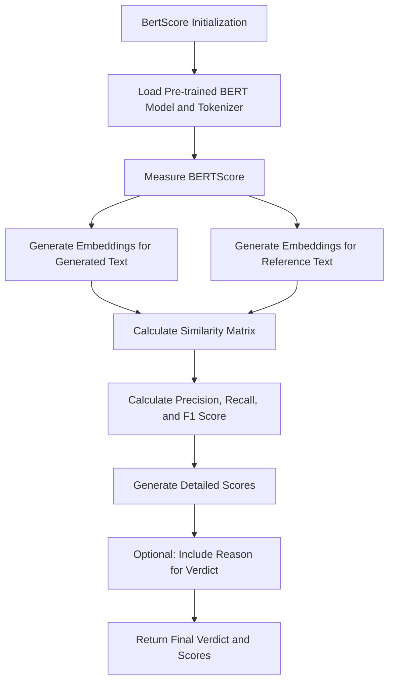

# BertScore

Class for evaluating semantic similarity between generated and reference texts using BERT embeddings.

## Initialization

```python
class BertScore:
    def __init__(
        self,
        generated: str,
        reference: str,
        embedding_model_name: str = "bert-base-uncased",
        include_reason: bool = True,
        device: str = "cuda" if torch.cuda.is_available() else "cpu",
        model=None,
    ):
```

## Hyperparameters

- **generated**: Generated text to be evaluated
- **reference**: Original reference text for comparison
- **embedding_model_name**: BERT model for embeddings (default: "bert-base-uncased")
- **include_reason**: Whether to include detailed reasons in output (default: True)
- **device**: Computation device (default: CUDA if available, else CPU)
- **model**: Optional language model for generating verdicts

## Usage Example

```python
from bertscore import BertScore
from languagemodels import LanguageModel

# Initialize the language model
llm = LanguageModel()

# Prepare generated and reference texts
generated_text = "The quick brown fox jumps over the lazy dog."
reference_text = "A fast brown fox leaps above a sleepy canine."

# Create BertScore instance
bert_metric = BertScore(
    generated=generated_text,
    reference=reference_text,
    include_reason=True,
    embedding_model_name="bert-base-uncased"
)

# Set the language model
bert_metric.set_model(llm)

# Perform semantic similarity evaluation
result = bert_metric.measure()

# Access the results
print(result['overall_score'])  # Overall semantic similarity score
print(result['detailed_scores'])  # Detailed BERTScore metrics
print(result['verdict'])  # Textual explanation of similarity
```

## Return Value

The `measure()` method returns a dictionary with:

- `overall_score`: Semantic similarity F1 score (0-1 range)
- `detailed_scores`: Comprehensive BERTScore metrics
  - `precision`: Semantic precision
  - `recall`: Semantic recall
  - `f1`: F1 score of semantic similarity
  - `details`: Additional similarity metrics
    - `avg_precision_similarity`
    - `avg_recall_similarity`
    - `token_matches`
    - `max_similarity`
    - `min_similarity`
- `verdict`: Detailed textual explanation of semantic similarity (if `include_reason` is True)

## Key Features

- Advanced semantic similarity assessment
- BERT-based embedding comparison
- Precision, recall, and F1 score calculation
- Flexible embedding model selection
- Configurable device support (CPU/CUDA)
- Detailed similarity metrics
- Optional natural language explanation

## Dependencies

- `torch`: Deep learning framework
- `transformers`: Hugging Face transformer models
- `numpy`: Numerical computing
- `scikit-learn`: Cosine similarity calculation
- `pydantic`: Data validation
- `loguru`: Logging
- `json`: Response parsing

## Computational Details

- Uses cosine similarity for embedding comparison
- Supports GPU acceleration via CUDA
- Configurable BERT embedding model
- Tracks token-level semantic matches

## Logging

The class logs token usage information, including:

- Total input tokens
- Total output tokens
- Total token count used during evaluation

## Error Handling

- Raises `ValueError` if:
  - No language model is set for verdict generation
  - Language model returns an empty response
- Provides robust embedding and similarity computation
- Graceful handling of verdict generation failures

## Extensibility

The class is designed to be easily extended:

- Customizable embedding model
- Pluggable language model for verdicts
- Flexible device support
- Detailed logging and

## Flow Chart



## Note

BertScore provides a sophisticated approach to semantic similarity evaluation, leveraging advanced transformer-based embeddings to capture nuanced textual relationships beyond simple lexical matching.
