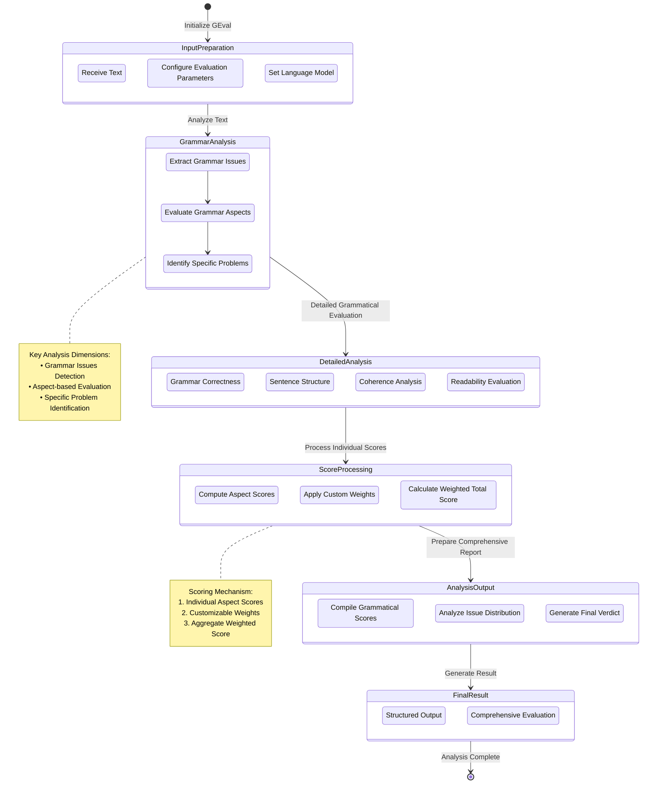

# GrammarEval

Class for evaluating the grammatical quality of a text through comprehensive linguistic analysis.

## Initialization

```python
class GEval:
    def __init__(
        self,
        summary: str,
        include_reason: bool = True,
        weights: Dict[str, float] = None,
    ):
```

## Hyperparameters

- **summary**: Text being evaluated for grammatical quality
- **include_reason**: Whether to include detailed reasons in output (default: True)
- **weights**: Custom weights for different grammatical aspects
  - Default:
    - Grammar Correctness: 0.35
    - Sentence Structure: 0.25
    - Coherence: 0.25
    - Readability: 0.15

## Usage Example

```python
from grammareval import GEval
from languagemodels import LanguageModel

# Initialize the language model
llm = LanguageModel()

# Prepare the text to be evaluated
text = "This is an example sentence with potential grammatical issues."

# Create GrammarEval instance
grammar_metric = GEval(
    summary=text,
    include_reason=True,
    weights={
        "grammar_correctness": 0.4,
        "sentence_structure": 0.3,
        "coherence": 0.2,
        "readability": 0.1
    }
)

# Set the language model
grammar_metric.set_model(llm)

# Perform grammatical evaluation
result = grammar_metric.measure()

# Access the results
print(result['score'])  # Overall grammatical quality score
print(result['grammar_issues'])  # Detailed grammar issues
```

## Return Value

The `measure()` method returns a dictionary with:

- `score`: Overall grammatical quality score
- `grammar_issues`: List of specific grammatical issues found
- `grammar_scores`: Detailed scores for different grammatical aspects
- `issue_distribution`: Distribution of grammar issues
- `verdict`: Explanatory verdict (if `include_reason` is True)

## Key Features

- Granular grammatical issue tracking
- Category-based linguistic analysis
- Importance-weighted scoring
- Detailed statistical reporting
- Comprehensive grammatical evaluation

## Flow Chart


