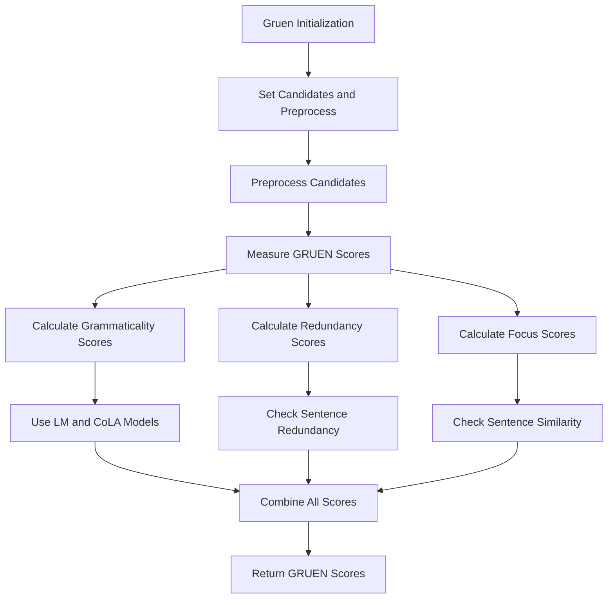

# Gruen

Class for evaluating the quality of generated text using various metrics, including grammaticality, redundancy, and focus.

## Initialization

The `Gruen` class is initialized with the following parameters:

- **candidates**: The candidate text(s) to evaluate.

```python
class Gruen:
    def __init__(self, candidates: Union[str, List[str]], use_spacy: bool = True, use_nltk: bool = True):
        """
        Initialize the TextEvaluator with candidate texts and options to use spacy and nltk.

        Parameters:
        candidates (Union[str, List[str]]): The candidate text(s) to evaluate.
        """
        if isinstance(candidates, str):
            candidates = [candidates]
        self.candidates = candidates
        self.stop_words = set(stopwords.words('english'))
        self.lemmatizer = WordNetLemmatizer()
```

## Parameters Explanation

- **candidates**: The actual texts to be evaluated. Can be a single string or a list of strings.

## Usage Example

Here is an example of how to use the `Gruen` class:

```python
from indoxJudge.metrics import Gruen
from indoxJudge.pipelines import Evaluator

# Define sample candidate texts
candidates = [
    "The quick brown fox jumps over the lazy dog.",
    "A fast brown fox leaps over a sleepy dog."
]

# Initialize the Gruen object
gruen = Gruen(
    candidates=candidates,
)

# Calculate the GRUEN scores
evaluator = Evaluator(model=None, metrics=[gruen])
result = evaluator.judge()
```

## Flow Chart


