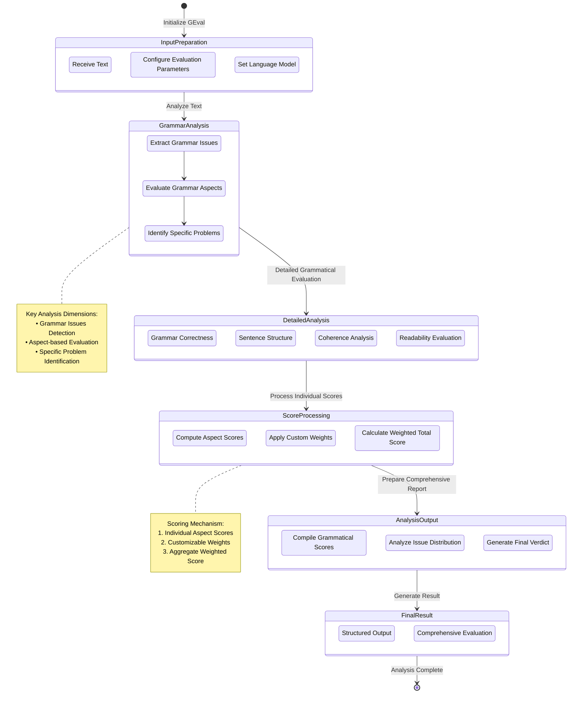

```mermaid
stateDiagram-v2
    direction TB

    [*] --> InputPreparation : Initialize GEval

    state InputPreparation {
        text : Receive Text
        config : Configure Evaluation Parameters
        model : Set Language Model
    }

    state GrammarAnalysis {
        direction TB
        issues : Extract Grammar Issues
        aspects : Evaluate Grammar Aspects
        subissues : Identify Specific Problems

        issues --> aspects
        aspects --> subissues
    }

    state ScoreProcessing {
        direction TB
        calculate : Compute Aspect Scores
        weight : Apply Custom Weights
        aggregate : Calculate Weighted Total Score
    }

    state AnalysisOutput {
        direction TB
        scores : Compile Grammatical Scores
        distribution : Analyze Issue Distribution
        verdict : Generate Final Verdict
    }

    InputPreparation --> GrammarAnalysis : Analyze Text

    state DetailedAnalysis {
        direction TB
        correctness : Grammar Correctness
        structure : Sentence Structure
        coherence : Coherence Analysis
        readability : Readability Evaluation
    }

    GrammarAnalysis --> DetailedAnalysis : Detailed Grammatical Evaluation
    DetailedAnalysis --> ScoreProcessing : Process Individual Scores
    ScoreProcessing --> AnalysisOutput : Prepare Comprehensive Report

    note right of GrammarAnalysis
        Key Analysis Dimensions:
        • Grammar Issues Detection
        • Aspect-based Evaluation
        • Specific Problem Identification
    end note

    note right of ScoreProcessing
        Scoring Mechanism:
        1. Individual Aspect Scores
        2. Customizable Weights
        3. Aggregate Weighted Score
    end note

    AnalysisOutput --> FinalResult : Generate Result

    state FinalResult {
        json : Structured Output
        metrics : Comprehensive Evaluation
    }

    FinalResult --> [*] : Analysis Complete

```
