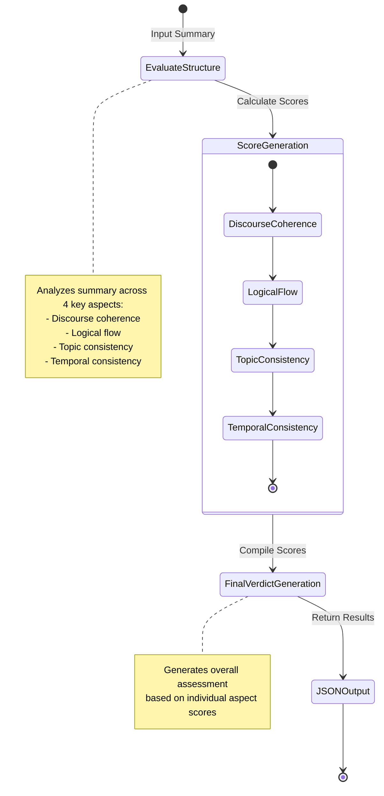

```mermaid
stateDiagram-v2
    [*] --> EvaluateStructure: Input Summary

    note right of EvaluateStructure
        Analyzes summary across 4 key aspects:
        - Discourse coherence
        - Logical flow
        - Topic consistency
        - Temporal consistency
    end note

    EvaluateStructure --> ScoreGeneration: Calculate Scores

    state ScoreGeneration {
        [*] --> DiscourseCoherence
        DiscourseCoherence --> LogicalFlow
        LogicalFlow --> TopicConsistency
        TopicConsistency --> TemporalConsistency
        TemporalConsistency --> [*]
    }

    ScoreGeneration --> FinalVerdictGeneration: Compile Scores

    note right of FinalVerdictGeneration
        Generates overall assessment
        based on individual aspect scores
    end note

    FinalVerdictGeneration --> JSONOutput: Return Results

    JSONOutput --> [*]

```
